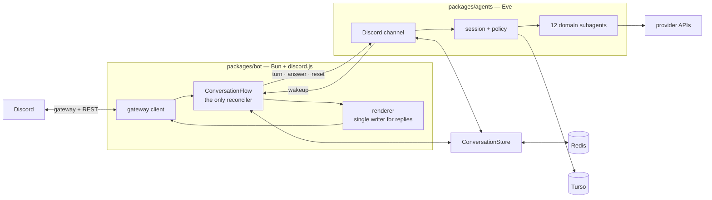

# Wack Hacker

AI agent for [Purdue Hackers](https://purduehackers.com), living in Discord. Mention it in a thread and it can read and act across the services the club runs on — GitHub, Linear, Notion, Vercel, Sentry, Figma, the CMS, the bank — without anyone leaving the channel.

- **Talk to your tools.** 670 provider operations behind 106 role-gated skills, in one conversation.
- **Conversations survive everything.** Threads persist across messages, restarts and deploys. Come back hours later and pick up where you left off.
- **Permissions follow your Discord role.** Public users get safe reads; organizers unlock writes; admins get destructive operations. Every decision is fail-closed and audited.
- **It schedules.** Ask for a reminder, a recurring post, or a one-off task at a specific time. Recurring jobs survive redeploys.
- **It can write code.** An admin-only subagent runs in an isolated Vercel Sandbox against a `purduehackers/*` repo, works on a branch, runs checks, and opens a PR.

## How it is put together

Two long-lived processes and a shared library. The package boundary is an ownership boundary, not just source layout.



| Package                              | What it owns                                                                                  | Docs                                |
| ------------------------------------ | --------------------------------------------------------------------------------------------- | ----------------------------------- |
| [`packages/bot`](packages/bot)       | The Discord gateway, slash commands, community automations, and rendering the agent's replies | [README](packages/bot/README.md)    |
| [`packages/agents`](packages/agents) | Sessions, reasoning, subagents, tools, policy, approvals, durable schedules                   | [README](packages/agents/README.md) |
| `packages/shared`                    | Cross-process schemas, the Redis conversation aggregate, the Drizzle schema, typed errors     | —                                   |

Redis is the coordination truth between the two processes; HTTP between them is transport and wakeup only. Neither package takes a value import from the other, so `discord.js` never enters the agent's runtime and the AI SDK never enters the bot's.

For the full picture — state machines, trust boundaries, execution traces, and current limitations — start with [System internals](docs/system/README.md).

## Running it locally

Requires [Bun](https://bun.sh) 1.3+ and Node 24+ (`eve build` needs it; see `.node-version`).

```bash
bun install
```

Fill in the per-package `.env.local` files — `.env.example` documents every variable and which phase it belongs to. Then run the two processes in separate terminals:

```bash
cd packages/agents && bun run dev
cd packages/bot     && bun run dev
```

Guild commands register automatically after a merge to `main`. To register from a workstation:

```bash
cd packages/bot && CONFIRM_COMMAND_GUILD=772576325897945119 bun run register-commands
```

## Deploying to Vercel

One Vercel project, rooted at `packages/agents`. The bot is **not** a Vercel project — it is a container the agent starts and supervises.

`eve deploy` cannot resolve the `@repo/shared` workspace dependency, so the project must build from the repository root.

### 1. Create the project

```bash
bunx vercel link            # from the repository root
```

In project settings:

| Setting                                  | Value                                                  |
| ---------------------------------------- | ------------------------------------------------------ |
| Root Directory                           | `packages/agents`                                      |
| Include files outside the root directory | **enabled** — required for `@repo/shared`              |
| Install Command                          | `bun install --frozen-lockfile` (run at the repo root) |
| Build Command                            | `bun run build`                                        |

### 2. Set environment variables

`.env.example` documents every variable and which capability it unlocks. The minimum for a running agent:

```bash
bunx vercel env add AGENT_INGRESS_SECRET production   # bot → agent bearer
bunx vercel env add BOT_INGRESS_SECRET production     # agent → bot bearer
bunx vercel env add UPSTASH_REDIS_REST_URL production
bunx vercel env add UPSTASH_REDIS_REST_TOKEN production
bunx vercel env add TURSO_DATABASE_URL production
bunx vercel env add TURSO_AUTH_TOKEN production
bunx vercel env add DISCORD_BOT_TOKEN production
```

Provider credentials are optional. A domain whose credential is absent stays visible to role policy and fails closed at execution — it is not silently hidden.

### 3. Apply the database schema

```bash
cd packages/shared && bun run db:migrate
```

### 4. Deploy the agent

```bash
bunx vercel deploy --prod
```

### 5. Point it at a bot

The agent needs somewhere to send turns. On Vercel that is a **Sandbox**: no
separate host, but Sandbox caps an instance at 24 hours, so the agent runs a
five-minute `bot-supervisor` schedule that starts a replacement and retires the
old one behind a Redis fence.

```bash
bunx vercel vcr login docker
docker buildx build --platform linux/amd64 -f packages/bot/Dockerfile \
  --output "type=image,name=vcr.vercel.com/<team>/<project>/wack-hacker:$(git rev-parse HEAD),push=true" .

bunx vercel env add BOT_SANDBOX_ENABLED production   # true
bunx vercel env add BOT_IMAGE production             # vcr.vercel.com/...@sha256:<digest>
```

Take the digest from the `exporting manifest list` line, not `exporting
manifest` — the list is what carries the platform index the supervisor resolves
through. `bun packages/shared/scripts/release-check.ts image <ref>` confirms the
registry serves that exact digest and that it contains `linux/amd64`.

`BOT_IMAGE` must be a full `@sha256:` digest, never a tag. VCR images are
project-scoped, so build and log in with the _same_ project whose credentials
start the sandbox, or Sandbox creation fails with image-not-found.

Running the bot locally instead — the normal loop while developing — needs
neither variable: set `BOT_SANDBOX_ENABLED=false`, leave `BOT_IMAGE` empty, and
point `BOT_URL` at your machine. `BOT_SANDBOX_ENABLED=true` with an empty
`BOT_IMAGE` fails the reconcile rather than starting a broken bot.

### Releasing after the first deploy

Do not repeat the manual steps above for production changes. Merging to `main` runs **Release bot** (`image.yml`): it builds `linux/amd64`, scans, attests provenance and an SBOM, pins `BOT_IMAGE` to the digest, rebuilds the serving deployment, and waits for the supervisor to adopt the digest and report healthy. To roll back, dispatch the same workflow with a known-good digest in `image` — it skips the build and re-pins that one.

That flow, its required GitHub variables and secrets, the smoke check, and rollback are documented in the [operations runbooks](docs/operations/README.md). A successful Vercel deployment is not a successful bot release until the smoke check passes.

## Contributing

Read [`AGENTS.md`](AGENTS.md) first — it carries the project conventions, including the lint policy. In short: schemas are canonical zod 4, type erasures are not accepted, and a lint suppression must be inline, single-rule, and carry its reason. The zod rules are enforced by `@rayhanadev/ox`, not by a checklist.
