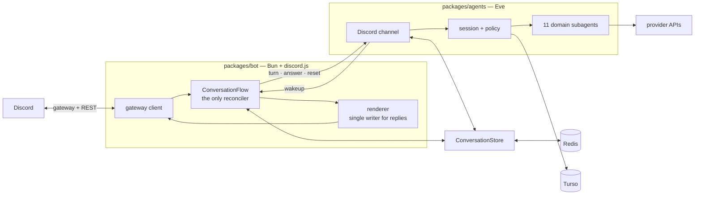

# Wack Hacker

AI agent for [Purdue Hackers](https://purduehackers.com), living in Discord. Mention it in a thread and it can read and act across the services the club runs on — GitHub, Linear, Notion, Vercel, Sentry, Figma, the CMS, the bank — without anyone leaving the channel.

- **Talk to your tools.** 659 provider operations behind 104 role-gated skills, in one conversation.
- **Conversations survive everything.** Threads persist across messages, restarts and deploys. Come back hours later and pick up where you left off.
- **Permissions follow your Discord role.** Public users get safe reads; organizers unlock writes; admins get destructive operations. Every decision is fail-closed and audited.
- **It schedules.** Ask for a reminder, a recurring post, or a one-off task at a specific time. Recurring jobs survive redeploys.
- **It can write code.** An admin-only subagent runs in an isolated Vercel Sandbox against a `purduehackers/*` repo, works on a branch, runs checks, and opens a PR.

## How it is put together

Two long-lived processes and a shared library. The package boundary is an ownership boundary, not just source layout.



| Package                              | What it owns                                                                                  | Docs                                |
| ------------------------------------ | --------------------------------------------------------------------------------------------- | ----------------------------------- |
| [`packages/bot`](packages/bot)       | The Discord gateway, slash commands, community automations, and rendering the agent's replies | [README](packages/bot/README.md)    |
| [`packages/agents`](packages/agents) | Sessions, reasoning, subagents, tools, policy, approvals, durable schedules                   | [README](packages/agents/README.md) |
| `packages/shared`                    | Cross-process schemas, the Redis conversation aggregate, the Drizzle schema, typed errors     | —                                   |

Redis is the coordination truth between the two processes; HTTP between them is transport and wakeup only. Neither package takes a value import from the other, so `discord.js` never enters the agent's runtime and the AI SDK never enters the bot's.

For the full picture — state machines, trust boundaries, execution traces, and current limitations — start with [System internals](docs/system/README.md).

## Running it locally

Requires [Bun](https://bun.sh) 1.3+ and Node 24+ (`eve build` needs it; see `.node-version`).

```bash
bun install
```

Fill in the per-package `.env.local` files — `.env.example` documents every variable and which phase it belongs to. Then run the two processes in separate terminals:

```bash
cd packages/agents && bun run dev
cd packages/bot     && bun run dev
```

Guild commands register automatically after a merge to `main`. To register from a workstation:

```bash
cd packages/bot && CONFIRM_COMMAND_GUILD=772576325897945119 bun run register-commands
```

### Checks

```bash
bun run lint     # oxlint — type-aware, so this reports TypeScript errors too
bun run format   # oxfmt
bun run build
```

There is no separate `typecheck` script: oxlint runs the type checker. There is no test suite — see [What this does not have](#what-this-does-not-have).

## Container

The bot image is host-agnostic. Build from the repository root so the shared workspace is in context:

```bash
docker build -f packages/bot/Dockerfile -t wack-hacker-bot .
docker run --env-file packages/bot/.env.local -p 8080:8080 wack-hacker-bot
```

Vercel Sandbox is the primary host; the same image runs on any persistent container host. Sandbox has a 24-hour cap, so an Eve schedule in `packages/agents` rotates the container before it expires. Persistent hosts do not need that — leave `BOT_SANDBOX_ENABLED=false`.

## Deployment

The Eve Vercel project is rooted at `packages/agents` and is the only Vercel project here. Promoting a reviewed bot digest is an _agent_ deployment, because `BOT_IMAGE` is agent configuration read by the bot-supervisor schedule.

Do not use abbreviated CLI recipes for production. Reviewed promotion, database quiescence and recovery, supervision cutover, smoke, and rollback are documented in the [operations runbooks](docs/operations/README.md).

## What this does not have

**No automated tests.** The previous suite characterized an architecture that no longer exists and was blocking the consolidation it was meant to protect. Skill and tool lifecycle behavior has no automated coverage and is verified by hand. The gates are formatting, type-aware lint, two structural checks (`check:capabilities`, `check:serialization`), a dependency audit, a migration check, and the build.

Known limitations are documented rather than elided — authored tool approvals have a fail-closed projection limitation, model-controlled media fetch has no host allowlist, and the renderer shares Discord rate-limit buckets with the agent's message tools. See [System internals](docs/system/README.md).

## Contributing

Read [`AGENTS.md`](AGENTS.md) first — it carries the project conventions, including the lint policy. In short: schemas are canonical zod 4, type erasures are not accepted, and a lint suppression must be inline, single-rule, and carry its reason. [`docs/zod-4-anti-patterns.md`](docs/zod-4-anti-patterns.md) catalogues the patterns this codebase rejects and what to write instead.
