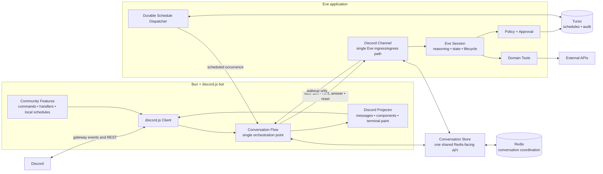
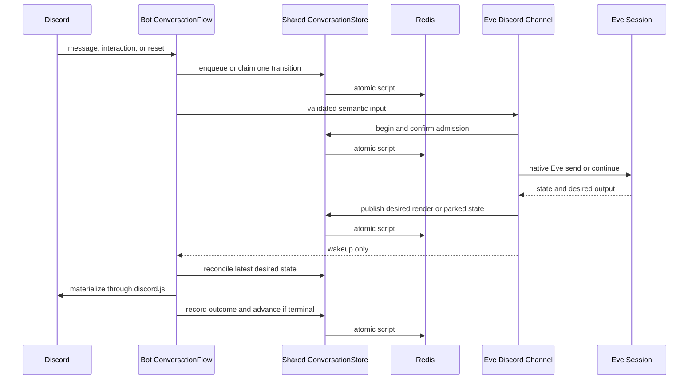
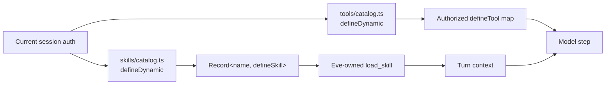

# Target architecture

> Status: current for the Group B conversation path. Later simplification groups
> may refine unrelated Discord and domain-runtime modules, but the single
> `ConversationFlow` and shared `ConversationStore` shown here are live.

Wack Hacker has two application runtimes: a Bun/discord.js bot that owns Discord
I/O and an Eve application that owns sessions and reasoning. Redis carries the
small amount of durable coordination shared between them. Hosting machinery is
an operational detail and is intentionally omitted from the core diagram.

## System diagram



## Conversation data flow



Redis remains the durable coordination boundary; HTTP is transport and wakeup.
The bot and Eve channel call the same project-owned `ConversationStore`, so no
runtime owns a second spelling of a key, record, or Lua transition. The bot's
`ConversationFlow` is the only reconciler that turns stored desired state into
Discord effects and advances the queue. “Centralized” means one visible
orchestration path and one storage API, not one large file or an attempt to hide
the distributed transition behind callbacks. Parked and render HTTP callbacks
validate and enqueue a wake hint, then return; startup and periodic scans of the
ready sets remain the recovery truth. The queue-completion Lua transition reads
the terminal render outcome itself, so caller ordering alone cannot advance a
parked delivery.

Scheduled occurrences use the same flow receipt: `message` actions post directly
through Discord, while `agent` actions create the existing placeholder-backed
queued turn.

## Current code boundaries

```text
packages/bot/src
├── index.ts                         # composition root
├── conversations/flow.ts           # the only conversation reconciler
└── agent/
    ├── client.ts                    # thin typed Eve HTTP transport
    ├── render/{renderer,discord-rest}.ts
    │                                # Discord projection adapter
    ├── hitl/interaction.ts          # Discord interaction adapter
    └── scheduled.ts                 # Discord schedule materialization

packages/agents/agent
├── channels/discord.ts              # thin Eve lifecycle adapter
├── tools/                            # root capabilities
├── subagents/<domain>/
│   ├── agent.ts                      # native Eve subagent declaration
│   ├── tools/catalog.ts              # independently policy-filtered tools
│   └── skills/catalog.ts             # defineDynamic + defineSkill skill map
└── schedules/                        # durable schedules and dispatch

packages/shared/src
├── conversations/
│   ├── keys.ts                       # private conversation key catalog
│   ├── schemas.ts                    # persisted conversation records
│   ├── store.ts                      # only exported Redis-facing API
│   └── *.ts                          # private eval/Lua transition modules
├── wire.ts                           # cross-process schemas, not Redis keys
├── errors.ts                         # project error taxonomy
└── domain data                       # only genuinely shared shapes
```

An optional process supervisor may start or replace the bot container, but it is
not part of the application data flow and should not shape application APIs.

## Eve-native subagent skills

Each subagent owns its skills under its own `skills/` directory. A single
`defineDynamic` resolver returns the authorized map of `defineSkill` values for
that subagent. Eve advertises those skills and supplies its framework-owned
`load_skill` tool.

The cleanup removes the parallel `skill-sources/` tree, generated skill registry,
custom `load_skill` definitions, activation-marker output, and message-history
parsing used to infer loaded skills. Loading a skill adds instructions through
Eve; it does not register tools. Tool availability is resolved independently on
`step.started` from current role and tool policy, then enforced again at approval
and execution. Missing provider configuration remains a typed execution-time
failure. No tool resolver reads `load_skill`
results or model-message history. A compiled lifecycle canary proves local
`defaultBackend()` materialization, repeated native loads on one preserved
session, and removal after the resolver returns `{}`. The compiled manifest also
contains the skill and tool resolver for every integration subagent. Hosted
sandbox reattachment is verified at deployment; a failure stops cutover rather
than adding a second loader.



## Simplification rules

1. The bot has one `ConversationFlow`; queueing, rendering, HITL, and reset code
   do not become independent mini-frameworks.
2. Both runtimes use one shared `ConversationStore`; Redis keys and atomic
   scripts remain private implementation details behind it.
3. Eve uses native `defineChannel`, `defineTool`, `defineState`, and schedule
   lifecycles instead of parallel local frameworks.
4. discord.js values remain discord.js values until they cross one of our wire
   boundaries.
5. Types for external contracts are derived from package exports. Manual types
   describe only Wack Hacker data.
6. `packages/shared` contains durable project contracts, not convenience
   wrappers or speculative abstraction layers.
7. Leaf adapters may isolate unavoidable I/O, but pass-through factories,
   single-use helpers, and interfaces created only for mocks should be removed.
8. Behaviorally important durability and authorization transitions remain
   explicit even when their implementation becomes smaller.

Meaningful state-machine, wire-contract, public-type, or package-boundary
changes require approval before implementation.
