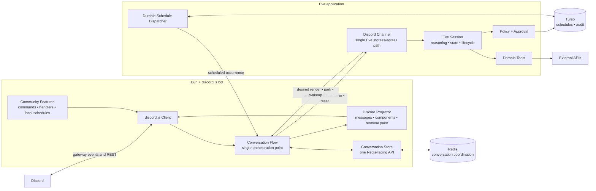
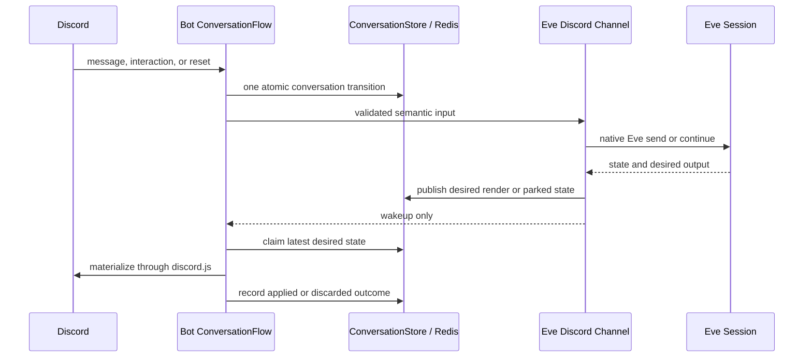
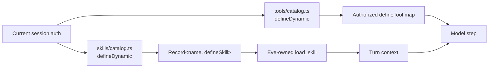

# Target architecture

> Status: proposed cleanup target. This diagram describes the architecture the
> simplification work should converge on; it is not a claim that the current
> module layout already matches it.

Wack Hacker has two application runtimes: a Bun/discord.js bot that owns Discord
I/O and an Eve application that owns sessions and reasoning. Redis carries the
small amount of durable coordination shared between them. Hosting machinery is
an operational detail and is intentionally omitted from the core diagram.

## System diagram



## Conversation data flow



Redis remains the durable coordination boundary; HTTP is transport and wakeup.
“Centralized” means one visible orchestration path and one storage API, not one
large file or an attempt to hide the distributed transition behind callbacks.

## Intended code boundaries

```text
packages/bot
├── app.ts                    # composition root only
├── conversations/
│   ├── flow.ts               # the only conversation orchestrator
│   ├── store.ts              # all conversation Redis transitions
│   ├── discord.ts            # discord.js input and projection
│   └── eve.ts                # thin typed Eve transport
└── features/                 # unrelated community commands/events/schedules

packages/agents
└── agent/
    ├── channels/discord.ts   # one Eve-side Discord lifecycle
    ├── tools/                # root capabilities
    ├── subagents/<domain>/
    │   ├── agent.ts          # native Eve subagent declaration
    │   ├── tools/catalog.ts  # defineDynamic policy-filtered tools
    │   └── skills/catalog.ts # defineDynamic + defineSkill skill map
    └── schedules/            # durable schedules and dispatch

packages/shared
├── wire.ts                   # our cross-process schemas
├── errors.ts                 # our error taxonomy
└── domain data               # only genuinely shared project-owned shapes
```

An optional process supervisor may start or replace the bot container, but it is
not part of the application data flow and should not shape application APIs.

## Eve-native subagent skills

Each subagent owns its skills under its own `skills/` directory. A single
`defineDynamic` resolver returns the authorized map of `defineSkill` values for
that subagent. Eve advertises those skills and supplies its framework-owned
`load_skill` tool.

The cleanup removes the parallel `skill-sources/` tree, generated skill registry,
custom `load_skill` definitions, activation-marker output, and message-history
parsing used to infer loaded skills. Loading a skill adds instructions through
Eve; it does not register tools. Tool availability is resolved independently by
the subagent's native dynamic tools file and enforced again at approval and
execution.



## Simplification rules

1. The bot has one `ConversationFlow`; queueing, rendering, HITL, and reset code
   do not become independent mini-frameworks.
2. The bot has one `ConversationStore`; Redis keys and atomic scripts remain
   private implementation details behind it.
3. Eve uses native `defineChannel`, `defineTool`, `defineState`, and schedule
   lifecycles instead of parallel local frameworks.
4. discord.js values remain discord.js values until they cross one of our wire
   boundaries.
5. Types for external contracts are derived from package exports. Manual types
   describe only Wack Hacker data.
6. `packages/shared` contains durable project contracts, not convenience
   wrappers or speculative abstraction layers.
7. Leaf adapters may isolate unavoidable I/O, but pass-through factories,
   single-use helpers, and interfaces created only for mocks should be removed.
8. Behaviorally important durability and authorization transitions remain
   explicit even when their implementation becomes smaller.

Meaningful state-machine, wire-contract, public-type, or package-boundary
changes require approval before implementation.
