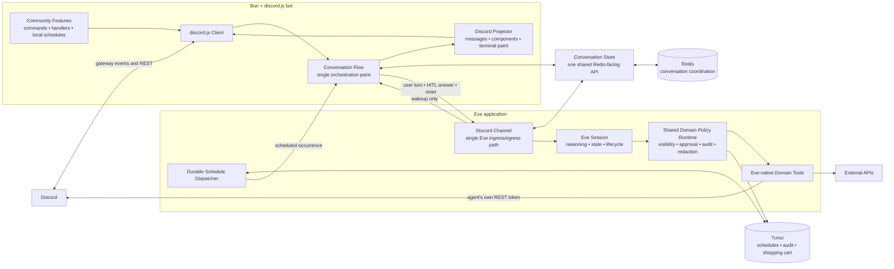
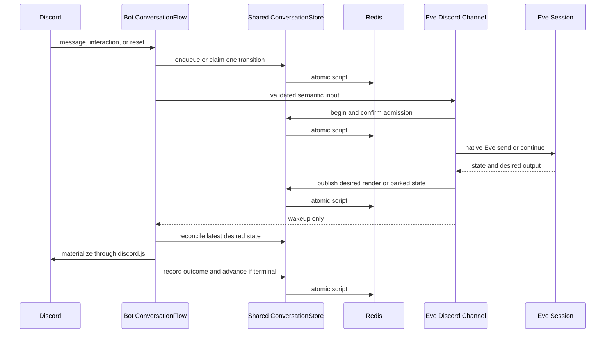

# Architecture

> Status: current after approved Groups A–E and the final security/simplification
> review. Hosted Eve `defaultBackend()` sandbox reattachment remains a deployment
> cutover canary, not a code blocker.
>
> The detailed code-reading guide is [System internals](system/README.md). It
> records current framework-default capabilities and approval-path limitations
> that the stable overview below does not elide.

Wack Hacker has two application runtimes: a Bun/discord.js bot that owns Discord
I/O and an Eve application that owns sessions and reasoning. Redis carries the
small amount of durable coordination shared between them. Hosting machinery is
an operational detail and is intentionally omitted from the core diagram.

## System diagram



## Conversation data flow



Redis remains the durable coordination boundary; HTTP is transport and wakeup.
The bot and Eve channel call the same project-owned `ConversationStore`, so no
runtime owns a second spelling of a key, record, or Lua transition. The bot's
`ConversationFlow` is the only reconciler that turns stored desired state into
Discord effects and advances the queue. “Centralized” means one visible
orchestration path and one storage API, not one large file or an attempt to hide
the distributed transition behind callbacks. Parked and render HTTP callbacks
validate and enqueue a wake hint, then return; startup and periodic scans of the
ready sets remain the recovery truth. The queue-completion Lua transition reads
the terminal render outcome itself, so caller ordering alone cannot advance a
parked delivery.

Scheduled occurrences use the same flow receipt: `message` actions post directly
through Discord, while `agent` actions create the existing placeholder-backed
queued turn.

## Current code boundaries

```text
packages/bot/src
├── index.ts                              # composition root
├── utils/conversation/                    # the only conversation reconciler
├── agent/
│   ├── client.ts                         # thin typed Eve HTTP transport
│   ├── render/{renderer,discord-rest}.ts # Discord projection adapter
│   ├── hitl/interaction.ts               # Discord interaction adapter
│   └── scheduled.ts                      # Discord schedule materialization
└── framework/
    ├── server.ts                         # Bun HTTP dispatch and health endpoint
    └── lifecycle.ts                      # explicit reverse-order process teardown

packages/agents/agent
├── channels/discord.ts                   # thin Eve lifecycle adapter
├── lib/
│   ├── policy/
│   │   ├── domain-tools.ts               # shared DomainToolSpec and registry types
│   │   ├── domain-runtime.ts             # shared visibility/approval/execution/audit policy
│   │   ├── stores.ts                     # shared lazy approval, budget, and audit stores
│   │   ├── {usage-hook,domain-audit-hook}.ts
│   │   │                                 # shared hook implementations
│   │   └── provider-redaction.ts         # provider secret/error/output projection
│   └── schedule/store.ts                 # strict Zod libSQL row boundary and lease SQL
├── tools/                                # root capabilities
├── subagents/<domain>/
│   ├── agent.ts                          # native Eve subagent declaration
│   ├── tools/catalog.ts                  # direct inline Eve defineTool declarations
│   ├── skills/catalog.ts                 # defineDynamic + defineSkill skill map
│   ├── hooks/                            # thin Eve-discovered policy hook exports
│   └── lib/{registry,runtime}.ts        # tools + skill policy, narrow runtime adapter
│       lib/tool_defs/<bundle>/<tool>.ts # one file per tool
│       lib/skill_defs/<name>.md         # skill prose, imported as text
│       └── operations/*.ts               # (discord) REST calls + response projections
└── schedules/                            # durable schedules and dispatch

packages/shared/src
├── conversations/
│   ├── keys.ts                           # private conversation key catalog
│   ├── store.ts                          # only exported Redis-facing API
│   ├── render.ts                         # validates the stored render projection
│   └── *.ts                              # private keys, eval/Lua, and local record shapes
├── discord/                              # guild identifiers, roles, constants
├── bot/health.ts                         # shared bot health schemas and output types
├── bot/generation.ts                     # shared active-generation schema/decoder/reader
├── wire.ts                               # other cross-process schemas, not Redis keys
├── errors.ts                             # project error taxonomy
└── domain data                           # only genuinely shared shapes
```

Bot container supervision is an Eve schedule in the agent
(`agent/schedules/bot-supervisor.ts`). It may start or replace the bot
container, but it is not part of the application data flow and must not shape
application APIs: no tool, subagent, or channel route reaches it, and it shares
nothing with reasoning except the Redis client. It and release/operations
scripts consume the shared health and active-generation decoders rather than
restating those external records.

## Eve-native subagent skills

Each subagent owns its skills under its own `skills/` directory. A single
`defineDynamic` resolver returns the authorized map of `defineSkill` values for
that subagent. Eve advertises those skills and supplies its framework-owned
`load_skill` tool.

The cleanup removed the parallel `skill-sources/` tree, generated skill
registry, custom `load_skill` definitions, activation-marker output, and
message-history parsing used to infer loaded skills. Loading a skill adds
instructions through Eve; it does not register tools. Tool availability is
resolved independently on `step.started` from current role and tool policy, then
enforced again at approval and execution. Missing provider configuration remains
a typed execution-time failure. No tool resolver reads `load_skill` results or
model-message history.

Local `defaultBackend()` materialization, repeated native loads on one preserved
session, and removal after the resolver returns `{}` are Eve framework behavior
that no repository check currently proves — the compiled lifecycle canary that
did was removed with the test suite, so a resolver change must be verified by
hand. The compiled manifest still contains the skill and tool resolver for
every integration subagent. Hosted sandbox reattachment remains a required
deployment canary, but no current workflow or runbook executes it automatically.
Production cutover cannot claim this evidence until an explicit hosted check is
reviewed and run; the fallback is not a second loader.

```mermaid
flowchart LR
  Auth[Current session auth] --> Skills["skills/catalog.ts<br/>defineDynamic"]
  Skills --> SkillMap["Record&lt;name, defineSkill&gt;"]
  SkillMap --> EveLoader["Eve-owned load_skill"]
  EveLoader --> Context[Turn context]

  Auth --> Tools["tools/catalog.ts<br/>defineDynamic"]
  Tools --> ToolMap["Authorized inline defineTool map"]
  ToolMap --> Model[Model step]
  Context --> Model
```



## Discord domain tools

Discord is an ordinary provider domain: its 68 operations live in
`subagents/discord/lib/operations/` and call Discord's API with the agent
deployment's own REST identity, exactly as the Linear domain calls the Linear
SDK. There is no cross-process hop and no hand-written request/response
contract. Each operation owns its Zod input, its `Routes.*` call, and its
response projection, and each is a `defineDomainTool` carrying an `access`
descriptor, so authorization, approval, budget, and audit are the same shared
policy spine every domain uses. Malformed Discord results fail closed as a typed
upstream error instead of becoming `{}`, `[]`, or a partial success.

What stays on the bot is _paint_: the renderer in
`packages/bot/src/agent/render/discord-rest.ts` writes the agent's own replies
with nonce-enforced idempotency, because those share rate-limit buckets with the
gateway client and need a single writer for visible-commit convergence. The
accepted tradeoff is two REST clients with independent bucket state on the same
channel routes; both honour `retry_after`.

The operation modules use `Routes`, discord.js-exported v10 REST types, small
fail-closed object and array guards, and strict project-owned projection
schemas. They deliberately do **not** adopt discord.js managers or cache
semantics: the operations cover raw endpoints and require current REST results,
so managers would add a second behavior model without simplifying anything.

Archived threads follow each applicable public/private/joined route's native
cursor, reject missing or nonadvancing cursors, cap pagination, and deduplicate
results. Sticker creation preserves the 512 KiB media bound, uses MIME-correct
PNG/APNG/GIF/Lottie filenames, and sticker edits preserve omitted versus explicit
`null` descriptions. Role-position summaries use Discord's actual position
response.

## Shared domain policy runtime

All 11 integration domains author provider operations as `DomainToolSpec`
registries and bind narrow provider-specific configuration, error, projection,
and redaction adapters to one shared runtime. That runtime owns discovery,
approval, second-party authority, execution-time current-role and provider
readiness checks, budgets, audit ordering, and plain-JSON output enforcement.
Approval, budget, and audit stores are shared and lazy; usage and domain-audit
hooks share implementations while thin per-domain files remain for Eve filesystem
discovery. Scheduled deliveries may execute only tools whose effective
confirmation is `none`; tools requiring self or second-party confirmation fail
closed because a scheduled call has nobody present to approve it. Schedule
creation and cancellation are intended to revalidate the current organizer role
again at execution after self approval.

The project policy runtime governs project-authored catalogs, not Eve's whole
default harness. Root and ordinary non-code agents currently retain default
sandbox shell/file tools and web tools with default allow-all sandbox egress.
Those defaults bypass the project role/budget/confirmation/action-audit spine and
use Eve's own policies. Also, the custom Discord input projector requires a policy record for every tool
approval even though only second-party domain approval writes one, and proxied
child approvals look up the root rather than child session ID. Self and child
second-party controls therefore currently fail closed before execution. See the
[detailed policy limitations](system/eve-policy-and-integrations.md#known-discord-approval-projection-limitation).

Eve tool catalogs still call `defineTool` directly inside their `defineDynamic`
resolver and provide an inline `execute` closure. This source shape is required
for Eve replay reconstruction; a factory must not hide `defineTool`. The inline
closure delegates to the shared runtime. GitHub, Sentry, and Vercel retain
provider-secret redaction for requested actions, execution audit input, errors,
and output. Feature parity remains exact across 12 native domains, 670 tools,
106 skills, and 13 subagents.

## Shared deployment and schedule decoders

`healthReportSchema` and `readyHealthReportSchema` define the bot health response
used by the bot, supervisor, and release checks. `activeBotGenerationSchema`, its
decoder, and its narrow Redis reader define the fenced generation record used by
the supervisor, Eve endpoint resolution, and operations scripts.

The schedule store keeps raw conditional libSQL claims and migrations that are
immutable by policy, while strict Zod schemas decode selected view and claimed
rows. They reject
extra fields, invalid enums/counters/member-role JSON, and inconsistent
once-versus-recurring nullability before values enter domain logic.

## Simplification rules

1. The bot has one `ConversationFlow`; queueing, rendering, HITL, and reset code
   do not become independent mini-frameworks.
2. Both runtimes use one shared `ConversationStore`; Redis keys and atomic
   scripts remain private implementation details behind it.
3. Eve uses native `defineChannel`, `defineTool`, `defineState`, and schedule
   lifecycles instead of parallel local frameworks.
4. discord.js values remain discord.js values until they cross one of our wire
   boundaries.
5. Types for external contracts are derived from package exports. Manual types
   describe only Wack Hacker data.
6. `packages/shared` contains durable project contracts, not convenience
   wrappers or speculative abstraction layers.
7. Leaf adapters may isolate unavoidable I/O, but pass-through factories,
   single-use helpers, and interfaces created only for mocks should be removed.
8. Behaviorally important durability, serialization, redaction, and authorization
   transitions remain explicit even when their implementation becomes smaller.

Meaningful state-machine, wire-contract, public-type, or package-boundary changes
still require approval before implementation.
