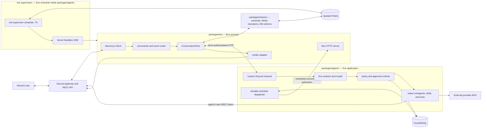

# System internals

This section explains the current Wack Hacker implementation from process startup
to durable recovery. It is a code-reading guide, not a proposal. Paths and call
stacks name the production modules that own each behavior.

## Read this in order

1. [Runtime map](runtime-map.md) — processes, trust boundaries, data ownership,
   dependencies, and configuration.
2. [Execution traces](execution-traces.md) — annotated call stacks and sequence
   diagrams for normal and failure paths.
3. [Conversation engine](conversation-engine.md) — Redis aggregate, queues,
   admission, rendering, HITL, reset, and recovery.
4. [Eve, policy, and integrations](eve-policy-and-integrations.md) — sessions,
   native skills/tools, authorization, provider domains, schedules, and the code
   sandbox.
5. [Discord and bot features](discord-and-bot.md) — gateway routing, the agent's
   Discord domain tools, commands, community handlers, and bot-local schedules.
6. [Storage, supervision, and operations](storage-supervision-and-operations.md) —
   Redis/Turso ownership, migrations, bot sandbox rotation, health, telemetry,
   CI, deployment, and incident inspection.

The shorter [architecture overview](../architecture.md) records the stable design
rules. The [operations runbooks](../operations/README.md) are the source of truth
for production procedures. This section explains _why and how_ those procedures
work; it does not replace them.

## One-sentence model

A single Bun/discord.js bot owns Discord, an Eve application owns reasoning and
tools, a shared Redis aggregate coordinates every conversation transition, Turso
stores durable schedules/audit/cart data, and an optional fenced supervisor keeps
the bot's digest-pinned container alive on Vercel Sandbox.

## System topology



## Non-negotiable ownership rules

| Concern                                 | Sole production owner                                      | Why                                                                                                                           |
| --------------------------------------- | ---------------------------------------------------------- | ----------------------------------------------------------------------------------------------------------------------------- |
| Discord gateway and reply rendering     | `packages/bot`                                             | One writer converges nonces and the visible-commit barrier; the agent's Discord tools are a separate provider identity.       |
| Eve sessions, model state, tool replay  | `packages/agents` and Eve                                  | The bot sends semantic deliveries; it does not emulate an agent runtime.                                                      |
| Conversation keys and Lua transitions   | `packages/shared/src/conversations`                        | Bot and agent use the same key spelling and atomic state machine.                                                             |
| Reconciliation and Discord paint        | `ConversationFlow` in `packages/bot`                       | One loop advances queues only after durable terminal visibility.                                                              |
| Project core/provider capability policy | `packages/agents/agent/lib/policy`                         | Project catalogs recheck current authority at discovery, approval, and execution; Eve defaults remain framework-owned.        |
| Durable schedules and action audit      | agent-side Turso access                                    | The bot deliberately has no database credentials.                                                                             |
| Active bot generation                   | fenced Redis record written by the bot-supervisor schedule | Container handoff cannot be decided by mutable host-local state.                                                              |
| Cross-process shapes                    | validated schemas/decoders in `packages/shared`            | Main wire unions are strict; health/generation intentionally ignore additive fields; static TypeScript alone is insufficient. |

## Current implementation limitations

The most security/operations-relevant current limitations are:

- root and ordinary non-code Eve agents retain default shell/file/web tools and
  allow-all sandbox egress; those defaults bypass project RBAC, budget,
  confirmation, and Turso action audit;
- the Discord input projector cannot resolve authored self approvals and uses
  the wrong session identity for proxied child second-party approval, so those
  controls fail closed before execution;
- no-confirmation Discord media-write tools can make bot-side arbitrary HTTP(S)
  fetches without a private-host guard and can buffer an undeclared-size body;
- the production database checkbox does not fence Eve's schedule writer, and the
  hosted Eve sandbox-reattachment canary is not implemented by a workflow or
  runbook; both remain production cutover blockers;
- active bot endpoint ownership is conventional rather than Redis-ACL/MAC
  enforced, so a valid-looking poisoned generation record can redirect the
  service-wide bot bearer.

Follow the linked evidence in [Eve, policy, and
integrations](eve-policy-and-integrations.md#framework-default-harness-surface),
[Discord and bot](discord-and-bot.md#important-endpoint-semantics), and
[storage/operations](storage-supervision-and-operations.md).

## Terms used throughout

- **continuation key** — Discord thread ID when present, otherwise channel ID. It
  is both the per-conversation queue address and Eve continuation token.
- **dispatch ID** — bot-generated UUID for one attempt to deliver a queued turn.
  It fences renders, admissions, HITL controls, and queue completion.
- **render revision** — monotonically increasing desired Discord state for a
  dispatch. A revision may be replayed only with identical content.
- **parked** — Eve reached a waiting or terminal boundary and atomically
  published the latest render state plus a durable marker for the bot.
- **terminal visibility barrier** — a queue item cannot complete until its
  terminal render outcome is durably `applied` or `discarded`.
- **current authority** — roles derived from the current delivery snapshot,
  never merely from who opened an older session. Ordinary tools do not re-fetch
  Discord mid-turn; HITL/reset/scheduled-agent paths explicitly do.
- **fence** — a token/lease/revision checked in the same atomic transition as the
  state change, preventing a stale worker from committing.
- **wakeup** — an HTTP callback that lowers latency but carries no authoritative
  state; recovery always rereads Redis or Turso.

## How to use the call stacks

The execution guide writes stacks from outermost trigger to deepest effect:

```text
external trigger
└─ composition or route function                 (path)
   └─ orchestration method                        (path)
      └─ store/provider operation                 (path)
         └─ atomic or external side effect
```

These are semantic stacks, not copied JavaScript exception output. Async work may
resume in a later process or recovery sweep; a `⇢` marker in that guide denotes
such a durable handoff.
