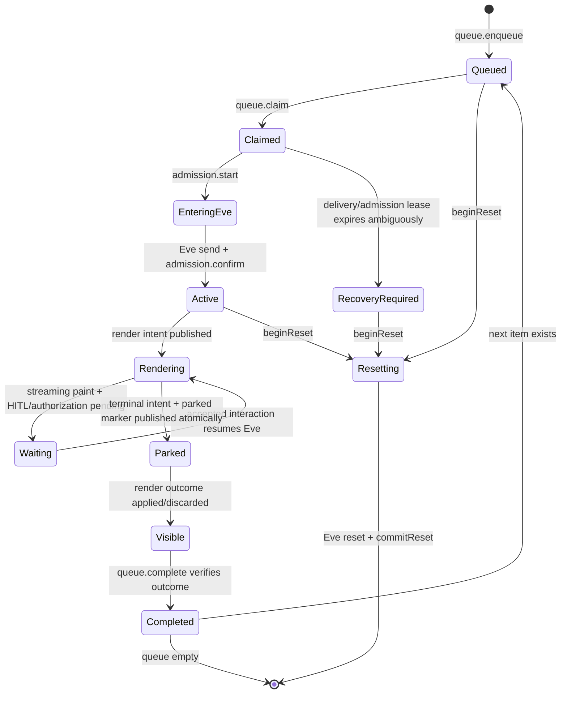

# Conversation engine

## Why this subsystem exists

Eve can resume a session by continuation token, but it is not a durable FIFO
mailbox for Discord gateway messages and it does not own Discord rendering. The
conversation engine supplies those missing application semantics:

1. exactly one active delivery per Discord thread/channel;
2. duplicate suppression and stable dispatch fencing;
3. a safe boundary before and after Eve accepts work;
4. coalesced desired rendering with resumable Discord checkpoints;
5. first-winner human-input claims;
6. reset cutover without old/new session overlap;
7. crash recovery from durable indexes rather than HTTP delivery luck.

All Redis keys and atomic transitions are private to
`packages/shared/src/conversations`. Both runtimes construct the same
`ConversationStore` from `store.ts`. `packages/bot/src/conversations/flow.ts`
contains the single reconciler that calls it. Atomic transitions execute the
literal production Lua through the injected Redis client's `eval` API. There is
no script-cache wrapper; adopting one would require equivalent injected-port and
`NOSCRIPT` fallback contracts.

## Aggregate identity and state

The aggregate is addressed by `continuationKey = threadId ?? channelId`. Each
user message receives a bot-generated `dispatchId` UUID when it enters the
queue. The Discord message ID deduplicates user delivery; the dispatch ID fences
every downstream artifact for that queue epoch.



`RecoveryRequired` deliberately does not replay an ambiguous Eve invocation. It
publishes one visible failure asking for reset. At-most-once reasoning is safer
than silently executing a tool twice.

## Redis key catalog

`packages/shared/src/conversations/keys.ts` defines 20 key families. Callers do
not interpolate these strings themselves.

| Family                                               | Type  | Scope/value                                       | Purpose                                                                                                          |
| ---------------------------------------------------- | ----- | ------------------------------------------------- | ---------------------------------------------------------------------------------------------------------------- |
| `agent:queues`                                       | set   | members `k:<continuationKey>`                     | Conversations with pending or active queue state                                                                 |
| `agent:ready`                                        | set   | members `k:<continuationKey>`                     | Parked conversations ready for queue reconciliation                                                              |
| `agent:render-ready`                                 | set   | members `r:<dispatchId>`                          | Dispatches whose desired render needs convergence                                                                |
| `pending:<continuationKey>`                          | list  | encoded `DeliveryPayload` JSON                    | FIFO user/scheduled deliveries                                                                                   |
| `agent:reset-pending:<continuationKey>`              | list  | deliveries arriving behind reset barrier          | Preserves new work while old session retires                                                                     |
| `agent:seen:<continuationKey>`                       | set   | Discord message IDs                               | Seven-day enqueue deduplication                                                                                  |
| `agent:active:<continuationKey>`                     | value | delivery + queue claim/lease/session fields       | One claimed/active delivery                                                                                      |
| `agent:reset:<continuationKey>`                      | value | reset UUID                                        | Fences reset ownership and blocks old admissions                                                                 |
| `agent:ingress:<continuationKey>`                    | value | admission attempt/dispatch status                 | Fences the exact window in which Eve may accept work                                                             |
| `agent:parked:<continuationKey>`                     | JSON  | strict `ParkedPayload`                            | Durable waiting/terminal marker for active delivery                                                              |
| `agent:render-target:<dispatchId>`                   | JSON  | immutable `RenderTarget`                          | Bot-authored channel/requester/anchor authority; initially no TTL, retained seven days after terminal settlement |
| `agent:render-intent:<dispatchId>`                   | JSON  | latest strict `RenderIntent`                      | Agent-authored desired Discord presentation                                                                      |
| `agent:render-projection:<dispatchId>`               | JSON  | applied revision, anchor and overflow checkpoints | Resume-safe materialized Discord state                                                                           |
| `agent:render-claim:<dispatchId>`                    | value | claim token with lease                            | One render worker at a time                                                                                      |
| `agent:render-outcome:<dispatchId>`                  | value | `applied` or `discarded`                          | Terminal visibility barrier                                                                                      |
| `agent:hitl-claim:<dispatchId>`                      | JSON  | revision/request/interaction/status               | First-winner bot forwarding claim                                                                                |
| `agent:interaction-receipt:<interactionId>`          | JSON  | forwarding/accepted identity and response digest  | Agent-ingress idempotency and ambiguity recovery                                                                 |
| `agent:authorization:<dispatchId>:<authorizationId>` | JSON  | private challenge                                 | TTL-bound URL/code/instructions never placed in public render                                                    |
| `agent:authorization-index:<dispatchId>`             | set   | full authorization key strings                    | Reset/terminal cleanup of private challenges                                                                     |
| `agent:scheduled-fire:<occurrenceId>`                | JSON  | claim token or accepted receipt                   | Idempotent bot admission for one stable occurrence                                                               |

Only two index-member encodings exist: `k:<17–20 digit Discord ID>` and
`r:<UUID>`. Decoders reject malformed members, preventing a poison member from
being interpreted as an arbitrary Redis key.

## Leases and retention

| State                                 |              Duration | Consequence                                                                     |
| ------------------------------------- | --------------------: | ------------------------------------------------------------------------------- |
| Queue delivery lease                  |            30 seconds | Expired unconfirmed work is inspected for safe recovery, never blindly replayed |
| Agent admission record                |            15 minutes | Covers long Eve acceptance while retaining an ambiguity fence                   |
| Render worker claim                   | 45 seconds, renewable | A crashed painter can be reclaimed; stale worker checkpoints fail               |
| Seen message IDs                      |                7 days | Gateway/deployment replay does not enqueue twice                                |
| Render intent/projection/outcome data |                7 days | Restart and incident inspection can converge/reconstruct recent work            |
| HITL claim                            |                7 days | Old component clicks remain recognizably stale/claimed                          |
| Interaction receipt                   |                7 days | Same interaction can return its accepted acknowledgement                        |
| Scheduled-fire accepted receipt       |                7 days | Dispatcher retry cannot admit the same occurrence twice                         |
| Scheduled-fire forwarding claim       |             2 minutes | Failed/abandoned bot admission becomes retryable                                |
| Recovery sweep                        |      every 15 seconds | HTTP callback loss adds latency, not data loss                                  |

Authorization challenges derive their TTL from provider expiration with bounded
fallbacks; their index is cleaned as challenges complete.

## Queue lifecycle

### Enqueue

`ConversationFlow.submit()` calls `store.queue.enqueue()`.
`enqueueTurn()` creates the dispatch ID and immutable `RenderTarget` before its
Lua transition:

- duplicates by Discord message ID are ignored;
- work goes to `pending:*`, or `reset-pending:*` if a reset barrier exists;
- the conversation is inserted into `agent:queues`;
- the immutable render target is stored for the same dispatch.

The target records the actual render channel, parent/thread authority channel,
requester ID, and either an existing placeholder anchor or a reply target. Eve
cannot later redirect rendering by changing its intent.

### Claim and send

`ConversationFlow.kick()` atomically claims the FIFO head. The active record
contains a fresh `claimToken`, claim time, and lease expiry. The bot then calls
`AgentClient.sendMessage()` exactly once.

There are two different confirmations:

1. **Eve ingress confirmation** — after Eve `send()` returns, the channel calls
   `conversations.admission.confirm(payload, session.id)`. This proves the
   dispatch/message admission reached Eve.
2. **Bot queue acknowledgement** — after the HTTP response, `kick()` calls
   `queue.confirm(continuationKey, claimToken, sessionId)`. This proves the bot
   still owns the active queue claim.

They fence different crash windows and neither may replace the other. A fast Eve
park may consume the queue claim before the bot acknowledgement arrives, so the
latter is allowed to lose harmlessly.

### Ambiguous admission recovery

`AgentClient.sendMessage()` performs one HTTP attempt. A retry after an unknown
network outcome could invoke Eve twice. Periodic `recoverActiveQueues()` instead
calls the production `RECOVER_ADMISSION_SCRIPT`. If an active delivery lease
expired without a durable admission acknowledgement, it writes a terminal
`recovery-required` render and changes the active phase to `recovery-required`.
It deliberately does **not** write a parked marker or complete the queue; that
continuation remains blocked until reset. The user gets explicit remediation,
and later keys are still processed if one queue is malformed or throws.

## Agent ingress

The message route in `packages/agents/agent/channels/discord.ts` performs, in
order:

1. constant-time bearer authentication;
2. `decodeDeliveryPayload()` strict Zod validation;
3. first-session-only lead-in context selection;
4. `conversations.admission.start(payload)` as the final side effect before Eve;
5. `send(..., { auth, continuationToken, state })`;
6. `admission.confirm(payload, session.id)`;
7. `admission.finish(...)` in `finally`.

Admission outcomes distinguish:

- `start` — this caller owns admission;
- `accepted` — return the already accepted session acknowledgement;
- `in-progress` — same dispatch is entering Eve;
- `recovery-required` — prior ambiguous delivery must be reset;
- `resetting` or `stale` — current queue epoch may not enter.

Attachments become AI SDK `UserContent` with URL/file metadata. Lead-in and
referenced context are seeded only for a newly resolved session so follow-ups do
not duplicate history.

## Desired rendering

Eve channel state tracks current text, activity, pending input/authorization
projections, dispatch identity, render revision, final phase/footer, token/tool
counts, and whether terminal state settled. Channel lifecycle events mutate that
state:

- `turn.started` adopts current delivery targeting;
- `message.appended` coalesces streaming text and periodically publishes;
- `message.completed` closes the streaming message;
- `actions.requested` / `action.result` maintain activity text;
- `input.requested` creates a safe HITL projection;
- `authorization.required/completed` manage private challenge state;
- `turn.completed/failed` prepare terminal footer and phase;
- `session.waiting/completed/failed` publish the terminal boundary.

Streaming publication is throttled to roughly 1.5 seconds. Live text is capped
at 4,000 characters; final text at 12,000. `renderPublication.publish()` accepts
a higher revision or an identical replay. Reusing the same revision with
different content fails with:

- `render revision was reused with different content`, or
- `terminal render revision was reused with different content`.

`settleAndNotifyParked()` writes the final intent and parked marker in one Lua
transition. Only after that durable commit does it POST the low-latency parked
callback. Callback failure is logged and left to recovery. Terminal rendering
uses a stable anchor plus at most four overflow messages, splits near 1,900
characters, strips interactive controls, and removes stale overflow.

## Render convergence

A sweep always renders before completing parked queues:

```text
ConversationFlow.sweepOnce()
├─ renderDispatches()
│  └─ applyLatest(dispatchId)
│     ├─ store.render.claim()
│     ├─ loadWork(): intent + immutable target + projection
│     ├─ createRenderer(...).write()
│     │  ├─ Discord REST create/edit/delete
│     │  └─ store.render.checkpoint() after visible effects
│     ├─ optional turn-message index
│     └─ store.render.complete(..., terminal)
├─ reconcileParked()
│  └─ onParked()
│     ├─ read render outcome
│     └─ queue.complete()                    # atomically verifies outcome
└─ recoverActiveQueues()
```

At most four render workers run concurrently across dispatches. Within a
dispatch, a renewable claim token serializes paint. The renderer checkpoints the
anchor and overflow messages after effects, allowing a replacement process to
continue without reposting already durable content. Losing the token reports
`render lease was lost` and prevents stale completion.

If a newer revision arrived while painting, `render.complete()` returns `newer`
and the worker loops. Terminal success records `applied`. Unrecoverable malformed
intent/target/projection or selected permanent 4xx paint failures record
`discarded`, allowing the queue to progress without claiming the user saw a
successful render. Until one exists, the reconciler reports
`terminal Discord render is still pending` and does not advance.

## Human-in-the-loop flow

Public component identifiers carry opaque locators, not authority. On click:

1. `dispatchInteraction()` gives the HITL handler first refusal before slash
   commands.
2. `createHitlInteractionHandler()` decodes the component/modal locator and
   loads current `RenderTarget`/intent from Redis.
3. It validates dispatch, render revision, pending request, recipient, and
   current Discord identity/roles. For second-party approval it also refreshes
   the original requester.
4. `ConversationFlow.answer()` calls `store.hitl.claim()`; only one interaction
   can acquire the dispatch/revision/request.
5. `AgentClient.sendInteraction()` retries idempotently with the same Discord
   interaction ID.
6. Agent ingress `interactions.claim()` binds the response digest and returns an
   already accepted receipt on replay.
7. Eve `send({ inputResponses: [...] })` resumes the session with current auth.
8. Both interaction and HITL receipts transition to accepted.

A claim is not released when bot-to-agent forwarding exhausts its quick retries.
The seven-day dispatch/revision claim then rejects later clicks as already
claimed; an agent-side `forwarding` receipt is likewise not reclaimed normally.
Reset is the practical remediation for this stranded state.

That stack works for question inputs. Tool approval projection currently fails
closed earlier: it demands a policy record even for self approval, whose callback
does not write one, and proxied child approval is looked up with the root session
ID rather than the child session ID used by the writer. No fallback control is
published. See the [policy limitation](eve-policy-and-integrations.md#known-discord-approval-projection-limitation).

In the intended post-projection path, the persisted second-party policy, not the
button, binds requester, tool, risk, minimum approver role, session and call ID.
Requester and approver must be distinct and both retain sufficient current roles.
Execution remains owned by the original requester; audit `decidedBy` names the
approver.

## Provider authorization challenges

Connection authorization is intentionally split:

- public render intent contains only name/display name/recipient and an opaque
  authorization ID;
- private HTTPS URL, user code and instructions live under the TTL-bound Redis
  challenge key;
- credentials in URLs, non-HTTPS URLs, fragments of unvalidated provider data,
  and public link materialization are rejected;
- completion removes the challenge and its index entry.

This keeps short-lived provider authorization material out of Discord history.
No current authored provider catalog uses an end-user Connect/OAuth credential;
the integrations use service credentials. This is a generic channel capability
for Eve authorization events, not evidence of active per-user provider auth.

## Reset cutover

A reset is a fenced two-phase operation:

1. `queue.beginReset()` creates or returns the reset owner token and diverts new
   deliveries to `reset-pending:*`.
2. The bot calls the agent reset route with that token.
3. The agent waits briefly for any admission record to drain. A busy ingress
   returns 503; lost reset ownership returns 409.
4. Eve `reset({ continuationToken, reason })` retires session state.
5. The bot calls `queue.commitReset()` with the same token. Lua removes old
   active/parked/render-ready state, promotes reset-pending work, updates indexes,
   and deletes the barrier.
6. The bot kicks the first post-reset delivery.

An ambiguous remote reset keeps the barrier installed. A later reset reuses the
same identity and safely finishes the cutover instead of mixing old and new
session generations. Reset commit deliberately retains seen-message,
interaction-receipt, and terminal turn-message indexes. As a result, an
authorized ✅ on an old still-indexed terminal reply can reset whatever session
currently occupies that continuation key; the reset request is not fenced by the
old session ID.

## Scheduled-fire admission

The agent schedule dispatcher gives the bot a strict `ScheduledFirePayload`.
`ConversationFlow.admitSchedule()` first claims
`agent:scheduled-fire:<occurrenceId>`.

- action type `message` posts directly through Discord without refreshing the
  owner's membership/roles;
- action type `agent` refreshes the owner, then creates the normal
  placeholder-backed scheduled `MessagePayload` and calls `submit()`.

Only after the adapter succeeds is the occurrence receipt marked accepted. On
failure the exact claim token is released, allowing the schedule store's retry.
The distinction between message and agent actions is preserved end to end.

## Recovery and process lifecycle

`flow.start()` runs a full sweep before installing the 15-second interval. A
stop racing that first sweep cannot install the timer afterward. `wake()` merely
adds optional dispatch/continuation hints and schedules a microtask; concurrent
wakeups coalesce into the running sweep. If another wake arrives during a sweep,
the loop runs again before becoming idle.

`flow.stop()`:

- rejects new scheduled sweep work;
- clears the interval;
- waits up to 15 seconds for the active sweep;
- leaves every unfinished unit recoverable from Redis leases and indexes.

The stop flag prevents normal kick/wake progress, but `submit()` can still enqueue
and `reset()`, `answer()`, or `admitSchedule()` have no universal top-level stop
rejection. During the narrow shutdown interval, a caller already holding a
reference can still enter some remote work before HTTP/gateway teardown.

No correctness path requires the HTTP parked/render callback to arrive, the same
process to remain alive, or callbacks to arrive in order.

## Failure classification

| Failure                            | Behavior                                                                        |
| ---------------------------------- | ------------------------------------------------------------------------------- |
| Strict payload/record decode fails | Typed invalid input or captured defect; no partial success                      |
| Eve returns 4xx                    | `UpstreamError`; not retried as transport ambiguity                             |
| Eve returns 5xx/socket failure     | `Transient`; message admission itself is still single-attempt                   |
| Render malformed/missing target    | Captured defect and durable discard                                             |
| Discord retryable failure          | Claim released/expired; later sweep retries                                     |
| Discord selected permanent 4xx     | Durable discard where retry cannot help                                         |
| Redis unavailable                  | Current transition fails; no in-memory state is promoted to truth               |
| Callback unavailable               | Durable marker remains; periodic/startup sweep recovers                         |
| Poison queue/index member          | Rejected/isolated so later keys continue                                        |
| Admission ambiguity                | Visible `RecoveryRequired`; require reset instead of replay                     |
| HITL forwarding fails after claim  | Claim/receipt remain; later clicks do not retry; reset is practical remediation |

## Tests that characterize the state machine

- unit characterization under `packages/shared/src/conversations/*.test.ts`;
- `packages/bot/src/conversations/flow*.test.ts` for lifecycle orchestration;
- `packages/bot/src/agent/client.test.ts` for retry semantics;
- `packages/bot/src/agent/scheduled.test.ts` for role refresh/fallback;
- `tests/contracts/conversation.contract.test.ts` against a real loopback Redis
  and the production Lua strings.

The Docker contract runner creates randomly named isolated services, uses only
loopback exposure, runs serially, and unconditionally removes containers and
networks.
