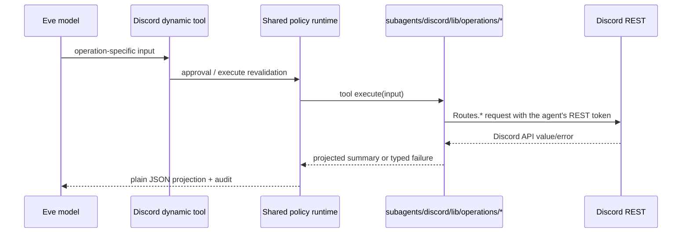

# Discord and bot systems

## Discord ownership

`packages/bot` owns the single discord.js gateway client and is the only writer
of the agent's own replies. It is **not** the only Discord principal: the agent
deployment holds the same `DISCORD_BOT_TOKEN` as an optional provider credential
and calls Discord REST directly from its Discord domain tools, described under
[Discord operations](#discord-operations). Those tools are bounded by the shared
policy runtime rather than by a wire contract, and they never render agent
replies.

The bot process contains two distinct application surfaces:

1. **conversation surface** — addressed messages, placeholder/render/HITL/reset,
   covered in [Conversation engine](conversation-engine.md);
2. **community surface** — slash commands, gateway automations, and local cron.

They share the Discord client and telemetry, not authorization or state machines.

## Gateway configuration

`framework/gateway.ts` creates a client with intents:

- Guilds;
- GuildMessages;
- privileged MessageContent;
- GuildMessageReactions.

Partials are Message, Reaction, and Channel. There is no DM or GuildMembers
intent; handlers that need a member role refresh use targeted REST fetches.
Presence is online/watching. discord.js supplies the WebSocket identity, current
gateway state, and its rate-limit-aware REST manager.

The application is designed for the fixed Purdue Hackers guild
`772576325897945119`. Slash commands are registered only there. The generic
gateway router does not itself reject other guild IDs, so exclusive bot
installation is an operational privacy boundary for otherwise unscoped handlers.

## Event router

`attachEventRouter()` attaches MessageCreate, MessageDelete,
MessageReactionAdd, and MessageReactionRemove. `InteractionCreate` is attached
separately for HITL and slash commands.

### Addressing and ordering

A message addresses Eve only when:

- `<@bot>` or `<@!bot>` starts the content; or
- it replies to a bot message inside a thread.

Derived `mention` handlers run to completion before ordinary `message` handlers.
Ordinary handlers receive `isBotMention=true` and can skip agent-directed text.
Within either group, sibling handlers run concurrently with `Promise.all`.
Different gateway events are also concurrent because discord.js does not await
listeners.

Bot-authored messages and bot reactors are dropped. Deletes are not
sender-filtered. Partials are not force-fetched by the router; individual
handlers decide if they need current data. There are currently no
reaction-remove or message-update behaviors.

### Handler-level deduplication

Before filtering or side effects, each handler claims:

```text
dedup:<handlerName>:<eventKey> = 1, NX, PX 300000
```

The handler name scopes the claim so sibling behaviors each see the same event.
Five minutes covers gateway RESUME replay and brief deployment overlap. Redis
failure fails closed and skips side effects. Claims are not released when a
handler later fails, so the bias is at-most-once for five minutes rather than an
event retry queue.

Every executed handler is wrapped by `instrument()`. Expected typed errors are
counted/logged; invariant/untyped defects also reach Sentry. One sibling's
failure cannot cancel another.

## Discord operations

### Where they run

Every Discord operation the model can invoke is an ordinary domain tool in the
Discord subagent, executed against the agent deployment's own Discord REST
identity — the same shape as Linear, Notion, GitHub, or Vercel. There is no RPC
hop and no hand-written request/response contract.



The bot keeps the Discord work only it can do: the gateway connection, community
handlers and slash commands, HITL interaction responses, and **rendering** —
`agent/render/discord-rest.ts` writing the agent's replies with nonce-enforced
idempotency. Those never crossed this seam and are unaffected.

The tradeoff taken deliberately: the renderer and the agent's message tools are
now two REST clients with independent rate-limit bucket state on the same
channel routes. Both honour `retry_after`; at this guild's volume the collision
risk is accepted in exchange for deleting the RPC layer.

### Operation modules

`subagents/discord/lib/operations/` holds the 68 operations, grouped by surface:
`members.ts`, `roles-channels.ts`, `assets.ts` (emoji/sticker/webhook),
`guild.ts` (guild/events/invites/audit/automod), and `messages.ts`
(messages/reactions/threads). Each entry is a `defineDomainTool` carrying its
`access` descriptor, so authorization, approval, budget, and audit are the
shared policy spine — identical to every other domain.

Missing configuration is declined by the runtime's `configurationError`: without
`DISCORD_BOT_TOKEN` the tools stay visible to role policy and fail closed at
execution, exactly like a missing `LINEAR_API_KEY`.

### Endpoint semantics that still matter

- Archived thread listing requires a channel. It follows public, private, and
  joined-private routes with each route's native cursor, deduplicates IDs, caps
  traversal, and rejects missing/nonadvancing cursors instead of returning a
  partial list.
- Sticker creation downloads bounded media, preserves the 512 KiB limit, and
  assigns correct PNG/APNG/GIF/Lottie filenames. Editing distinguishes omitted
  description from explicit `null`.
- Role-position tools summarize the role returned by Discord's position update,
  not a guessed local value.
- Real timestamp fields use ISO schemas. Provider-owned automod nested JSON
  remains explicitly pass-through where the public wire already requires it.
- Webhook results never project credentials/tokens.

### Model-controlled media fetch

Emoji, sticker, role-icon, webhook-avatar, and scheduled-event image operations
take an `httpUrl` the model supplies. `operations/common.ts::download()` rejects
embedded credentials and non-HTTP(S) schemes, follows redirects, times out after
15 seconds, checks the MIME type, and enforces both the declared `Content-Length`
and the actual byte length. It has **no host or private-IP allowlist**, and
without `Content-Length` the body is fully buffered by `arrayBuffer()` before the
actual-size rejection can fire.

These operations declare `risk: "write"`, whose default confirmation is `none`,
so there is no per-URL human gate: the only gate is the organizer-only Discord
subagent descriptor. Moving the operations out of the bot did not shrink this
surface — it moved the fetch into the agent process, which holds every provider
credential rather than only the Discord token. This is a described limitation,
not a claim that it is desirable.

## Slash command system

Commands are built at startup, but registration is never a boot side effect. It
is a standalone script, `packages/bot/scripts/register-commands.ts`, run by the
`register-commands` CI job after a merge to `main` and available to an operator
directly:

```bash
cd packages/bot
CONFIRM_COMMAND_GUILD=772576325897945119 bun run register-commands
```

Registration PUTs exactly `/ping`, `/privacy`, and `/hack-night` to the fixed
guild and refuses a mismatched confirmation guild, so the CI job cannot reach a
different guild even with a misconfigured secret. The PUT replaces the whole
command set, which is what makes repeating it on every merge safe.

### Common interaction dispatch

```text
Discord InteractionCreate
└─ dispatchInteraction()
   ├─ HITL handler first
   ├─ ignore non-chat-input
   ├─ SET bot:interaction:<id> NX EX 86400
   ├─ find command by registered name
   └─ trace + instrument(command.run)
      └─ reply/defer/edit/followUp
```

A Redis claim outage fails closed with an ephemeral temporary-unavailable
message. A duplicate is silently ignored because the winner should reply.
Unknown command skew is an invariant defect. All handler failures receive a
generic ephemeral error; typed details remain in telemetry.

### `/ping`

Public health check. It reports elapsed time since the interaction snowflake's
creation and rounded gateway ping. A malformed/nonpositive snowflake still
reports gateway ping.

### `/privacy`

Self-scoped, always ephemeral. One toggle — `view`, `opt-out`, `opt-in` —
stored as a Redis set of opted-out user ids (`@repo/shared/privacy`).

The user id always comes from the interaction, never from an option, so the
command cannot read or change anyone else's setting and needs no role gate.

Enforcement is local and lives at the three publish points, each checking
`isOptedOut` before it uploads: `emit-ship-message`, `emit-dashboard-message`,
and `hack-night-images`. Opting out is forward-looking — it stops future
uploads and does not delete what is already public.

### `/hack-night`

Current organizer/admin only, always ephemeral:

- `start` validates one Extended_Pictographic code point and a version, renames
  the fixed channel's leading emoji, then updates Dashboard Edge Config;
- `reset` restores the moon prefix and does not change dashboard version.

Discord rename precedes Edge Config update. A partial failure may leave the
channel renamed; rerunning is the convergence path.

## Community message and reaction handlers

### `praise`

A non-agent guild message containing flexible/case-insensitive
`wackity hackity praise me` grants the WACKY role and reacts 🥳;
`wackity hackity go away` removes it and reacts 🤐. WACKY is celebratory state,
not an authorization tier.

### Agent-reply feedback

A reaction on a seven-day `turn-message` index entry emits an `ai.feedback`
telemetry event joined to the Eve session/turn. 👍, ❤️, 🔥, 💯, and ✅ are
positive; 👎 and ❌ are negative; every other named emoji is recorded as unknown.
The per-handler dedup key includes message, reactor, and emoji. Feedback neither
resumes Eve nor changes conversation state.

### `auto-thread`

For fixed #ship and #checkpoints, a post shows work when direct/forwarded text
contains a URL or direct/forwarded attachments exist.

- compliant: create a `<displayName> - <first 54 chars>` thread, three-day
  archive; WACKY members also receive ordered reactions and a celebration;
- noncompliant: copy, delete, then best-effort DM the author a saved copy and
  instructions.

Sibling community handlers are concurrent, so deletion is not an ordered gate
before external mirroring.

### Ship mirror

`emit-ship-message` folds direct/forwarded text, projects image/video media, and
POSTs a stable message-ID record to `ships.purduehackers.com`. MessageDelete
removes it; 404 is a normal no-op. There is no edit synchronization.

Eligibility is URL in folded text or at least one _direct_ attachment. A
forwarded attachment alone satisfies auto-thread but not ship mirror eligibility
unless forwarded text also has a URL. This is current behavior.

### Dashboard mirror

For non-agent public messages, `emit-dashboard-message`:

1. requires a guild and rejects private threads;
2. resolves parent/category;
3. excludes four fixed internal categories;
4. requires @everyone ViewChannel;
5. renders Discord markdown to HTML with REST-backed mention resolution;
6. POSTs raw markdown, HTML, author/channel/time, and attachment URLs to the
   Purdue Hackers dashboard API.

Uncertain category/permission fails closed. Mention resolution failures degrade
the rendered mention rather than aborting the whole mirror. There are no edit or
delete mirror handlers.

### Hack-night photo upload/removal

A direct image attachment is archived when the message is in any public or
private thread whose parent is fixed #hack-night and whose name begins
`Hack Night Images`. The handler resolves a Redis event slug (or date fallback),
deduplicates each `(source, batch, message, filename)` through Payload, downloads
and uploads sequentially, then reacts ✅ if every image succeeded or ❌ if any
failed.

On ❌ reaction, the original author or a freshly resolved organizer/admin may
bulk-delete Payload media for that Discord message. The bot clears its own ✅
reaction after removal. Per-attachment CMS failures are represented principally
by the visible ❌; the outer handler currently returns an instrumented success.

### Voice transcription

A Discord voice message with a `.ogg` attachment reacts 🎙️, downloads audio,
and uses Groq `whisper-large-v3-turbo` in English. Small files try whole-audio first;
size-class failures or files over 24 MiB use Ogg Opus chunks near 20 MiB.

`splitOggOpus()` preserves headers, sequence numbers, EOS bits and CRC. At most
10 chunks transcribe concurrently with one local retry. Partial output keeps
order with failure markers; long replies split under 1,900 characters. The first
message is a reply and subsequent pieces are ordinary channel messages.

## Bot-local schedules

These are Croner jobs inside the bot and are different from user-created durable
agent schedules. Every nominal Indiana-time occurrence claims:

```text
bot:schedule:<name>:<YYYYMMDDHHmm> = 1, NX, EX 14 days
```

`protect:true` blocks one process from overlapping itself. Claims survive body
failure, there is no catch-up/retry queue, and the next cron time is a different
key.

### Friday 20:00 — photography thread

Posts and pins a random hack-night greeting, removes one recent pin system
notice, starts `Hack Night Images - MM/DD`, pings the hack-night role in the
thread, then stores `hack-night-thread:<threadId> = hack-night-YYYY-MM-DD` for
seven days. Completed Discord effects are not rolled back if a later step fails.

### Friday 23:58 — Lightning Time countdown

Posts a two-minute warning and edits it through 16 charge boundaries plus
midnight using DST-safe absolute Indiana instants. Three `/users/@me` probes
estimate median REST latency so edits are sent slightly early. Individual frame
edit failures warn and continue; initial setup failure ends the job.

### Sunday 18:00 — cleanup

Chooses the first thread-bearing message from the latest ten hack-night channel
messages, resolves the stored slug or Friday fallback, lists CMS images, posts a
total/top-five contributor summary when nonempty, then archives and locks the
thread. A CMS/send failure before the final step prevents archive on that run.

## Community integrations

| Service               | Data/behavior                                                | Failure/timeout notes                                                |
| --------------------- | ------------------------------------------------------------ | -------------------------------------------------------------------- |
| Privacy DB            | Self preference CRUD                                         | Typed retries for rate/5xx/transport; no explicit fetch timeout      |
| Dashboard Edge Config | Hack-night version                                           | Parsed at startup; typed retry; no explicit fetch timeout            |
| Dashboard message API | Public message identity/content/HTML/attachments             | All non-2xx currently treated transient; no explicit timeout         |
| Ships                 | User/message/title/content/media metadata                    | Upstream message ID idempotence; rate/5xx retry; no explicit timeout |
| Payload CMS           | Hack-night media binary + source/batch/message/user metadata | 15s requests; 2,000-document listing cap; uploads not shared-retried |
| Groq                  | Raw Discord voice audio/transcript                           | Whole-file size fallback; chunk retry once                           |

## Current behavior and limitations

These details matter when diagnosing effects:

- The gateway router has no fixed-guild guard; exclusive installation is assumed.
- Event and bot-local schedule dedup claims occur before filters/work and are not
  released on failure.
- Community sibling handlers are concurrent. A deleted noncompliant ship post
  can race with dashboard publication.
- Dashboard and ships do not synchronize edits; dashboard does not synchronize
  deletion.
- `/privacy` is forward-looking only: opting out stops future uploads and
  does not retract anything already published.
- A prior reaction by the same user/message can suppress photo ❌ removal for
  five minutes because that handler's dedup key omits emoji.
- Payload attachment errors are collapsed into an outer success plus ❌ signal.
- Photography/cleanup select records by broad recent-name/thread heuristics.
- Missing post-midnight slug mapping can split Saturday uploads from Friday's
  archive batch.
- Several provider/CDN requests have no common deadline; CMS is the consistent
  timeout exception. Voice attachment download buffers the whole Discord CDN
  response before applying the 24 MiB whole-vs-chunk decision.
- A second process signal can cut short the first graceful drain because the
  shutdown operation is idempotent and the wrapper then exits.

These are descriptions of the current implementation, not promises that the
limitations are desirable.

## Parity

- the operation modules preserve nested malformed-data handling, stickers, role
  positions, legacy routes and archive pagination;
- the Discord operation modules project every response explicitly, so provider
  output contracts are visible in the source rather than inferred;
- `bun run check:capabilities` in `packages/agents` proves the exact 68-key registry.
