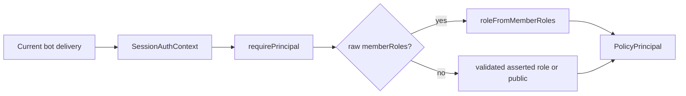

# Eve, policy, and integrations

## Responsibilities

The Eve application turns a validated Discord delivery into reasoning and safe
side effects. It owns:

- the durable session addressed by the Discord continuation key;
- current delivery auth and channel state;
- root and delegated model execution;
- native subagent, skill, and tool discovery;
- policy evaluation at discovery, approval, and execution;
- provider readiness, validation, redaction, output projection, and audit;
- durable application-managed schedules;
- semantic desired state, never Discord REST materialization.

The custom channel in `agent/channels/discord.ts` is the only Discord session
entry/exit path. It has no discord.js dependency and cannot read the bot token.

## Eve primitives used directly

| Eve primitive                    | Project use                                                                 |
| -------------------------------- | --------------------------------------------------------------------------- |
| `defineAgent`                    | Root agent and concrete delegated agents                                    |
| `defineChannel` + `POST`         | Authenticated Discord message/interaction/reset routes and lifecycle events |
| `defineState`                    | Durable channel/code-workspace state with plain-JSON initializers           |
| `defineDynamic`                  | Current-auth subagent, skill, and tool catalogs rebuilt at lifecycle events |
| `defineSkill`                    | Native skill instructions loaded by Eve's framework `load_skill`            |
| `defineTool`                     | Strict schema, approval callback, inline replayable executor                |
| `disableTool`                    | Removes unsafe built-in sandbox capabilities                                |
| `defineSchedule`                 | Once-per-minute durable schedule dispatch tick                              |
| `defineSandbox` + Vercel backend | Eve-owned code subagent environment lifecycle                               |

Project code does not reconstruct Eve's session, tool, or skill registries.

## Framework default harness surface

Native catalogs are not the complete model-facing tool set. Eve's default harness
also supplies tools according to session resources:

- `bash`, `read_file`, `write_file`, `glob`, and `grep` against the session's
  Eve-owned `/workspace` sandbox;
- app-runtime `web_fetch`, provider-managed `web_search`, durable `todo`, and
  `ask_question` where the channel supports input;
- root-only generic `agent` delegation in Eve, which this project explicitly
  disables in favor of the 13 declared/dynamic subagents;
- `load_skill` and connection discovery only when those resources exist.

Every Eve agent gets a default sandbox unless it authors an override. The backend
selection is hosted Vercel Sandbox, then local Docker, microsandbox, or just-bash
according to availability. Sandbox application environment/credentials are not
forwarded, but the default egress policy is `allow-all`. Root and ordinary
provider/docs subagents do not currently disable or restrict all default
shell/file/web tools. Therefore their effective surface is broader than the 689
project provider tools. The code subagent is the exception: it explicitly
disables the generic defaults and replaces them with bounded capabilities and an
allowlisted sandbox policy.

Treat framework defaults as real capabilities during threat modeling and policy
review; provider catalog parity does not count them. They also do not pass
through the project's role descriptors, public-user budget, confirmation policy,
or Turso action audit. Eve's own availability/approval rules apply instead. A
public or scheduled root session can therefore use an available default even
when a comparable project-authored tool would be hidden, audited, or denied.
Sandbox app credentials are absent, and Eve's app-runtime `web_fetch` has its own
private-address/stream-size protections, but sandbox shell egress remains the
default allow-all network surface. Root `sleep`/experimental Workflow are also
outside the project descriptor spine.

## Session and auth lifecycle

A bot delivery reaches `POST(WIRE_ROUTES.message)` in the custom channel. The
route uses the Discord continuation key as Eve `continuationToken` and calls
Eve's `send()`. For existing sessions Eve retains durable state/history while
refreshing `session.auth.current` from this delivery.

`authFor()` supplies:

- authenticator `discord`, principal type `user`, Discord principal ID;
- raw `memberRoles` plus a convenience resolved tier;
- channel/thread/guild targeting;
- source `chat` or `scheduled`;
- current message and dispatch IDs;
- optional schedule/occurrence IDs;
- optional original requester data for second-party execution.

`requirePrincipal()` is the one conversion to project policy. If raw roles are
present, it re-derives `public`, `organizer`, or `admin`; they override the
asserted tier. A valid asserted tier exists only as a fallback for non-Discord
adapters. The source is normalized to `chat` or `scheduled`. There is no
initiator/session-history authority fallback.

For an ordinary chat turn, “current” means the roles captured from the gateway
message's member cache at delivery. Discovery, approval, and execution repeatedly
rederive policy from that same `auth.current` snapshot; they do not fetch Discord
for every tool call. A mid-turn revocation can therefore race an unconfirmed
provider write. Targeted live refresh exists for HITL, reset, and scheduled
`agent` delivery; otherwise a new delivery supplies the next role snapshot.



## Native subagents and catalogs

There are 13 subagents:

- 11 provider domains: CMS, Discord, Figma, Finance, GitHub, Linear, Notion,
  Outreach, Sentry, Shopping, and Vercel;
- an admin-only code subagent;
- a documentation subagent.

The root rebuilds the full subagent map from current auth on every
`turn.started`. Provider domains are organizer-visible as delegated agents, code
is admin-only, and documentation is public only when its API is configured. A
provider domain can contain raw tool descriptors with lower minimum roles, but
those do not bypass the outer subagent discovery gate in ordinary root use.

`bun run check:capabilities` reports the surface it validates: 12 native
domains, 689 tools, 109 skills, and 14 subagents.

| Domain     | Tools | Skills |
| ---------- | ----: | -----: |
| Cloudflare |    29 |      5 |
| CMS        |    54 |      6 |
| Discord    |    68 |     14 |
| Figma      |    33 |      7 |
| Finance    |    16 |      6 |
| GitHub     |   119 |     16 |
| Linear     |    64 |     16 |
| Notion     |    24 |      4 |
| Outreach   |    42 |      8 |
| Sentry     |    68 |     15 |
| Shopping   |     6 |      1 |
| Vercel     |   166 |     11 |

Each integration has the same intentional filesystem shape:

```text
subagents/<domain>/
├─ agent.ts                 # native delegated agent declaration
├─ skills/catalog.ts        # defineDynamic -> authorized defineSkill map
├─ tools/catalog.ts         # defineDynamic -> authorized inline defineTool map
├─ hooks/usage.ts           # thin Eve-discovered export
├─ hooks/audit.ts           # where the domain has audit behavior
└─ lib/
   ├─ registry.ts           # provider operations, access metadata, and skill policy
   ├─ tool_defs/<bundle>/   # one file per tool, bundled by the skill that lists it
   ├─ skill_defs/<name>.md  # skill prose, imported as text
   ├─ runtime.ts            # thin domain adapter bound to shared policy runtime
   └─ provider-specific SDK/HTTP modules
```

### Skill lifecycle

At the catalog lifecycle event, current auth is evaluated and an authorized map
of `defineSkill` values is returned. Eve owns the `load_skill` tool and adds the
selected instructions to context. Repeated loads and removal on later downgrade
are framework behavior. No repository check currently exercises them: the
compiled lifecycle canary that did was removed with the test suite, so a change
to a catalog resolver must be verified by hand.

Loading a skill never grants authority. It does not mutate a local tool registry
or become an authorization record. Tool visibility is independently rebuilt from
current auth on `step.started`, then approval and execution re-evaluate.

### Replay constraint

Eve 0.31.3 reconstructs dynamic tools by scanning authored source syntax.
Consequently every integration tool catalog keeps:

- an inline `defineDynamic` expression;
- direct inline `defineTool({ approval, execute })` calls;
- the replayable `execute` closure at the definition site.

The closure may delegate to shared policy/runtime code, but a factory may not hide
`defineTool`. `scripts/check-serialization-boundaries.ts` also verifies tool
executors and state initializers are guarded plain-JSON boundaries.

## Capability descriptors

Every project policy-governed subagent, skill, and core/domain tool is described
by project-owned, JSON-only data. Eve framework defaults and lifecycle utilities
are outside this descriptor set:

```text
kind: subagent | tool | skill
name: stable capability name
minRole: public | organizer | admin
risk: read | write | destructive
confirmation?: none | self | second-party
```

Default confirmation is `none` for read/write and `self` for destructive.
Integration tool registries usually default read tools to public and mutations to
organizer unless they specify stronger access.

## Policy evaluation

`decideCapability()` in `lib/policy/engine.ts` is the stable Verdex entry point.
It computes three independent outputs:

- `discover` — may the model see the capability? Role only;
- `execute` — do role, budget and available-confirmation constraints permit it?;
- `approve` — `none`, `self`, `second-party`, or fail-closed `deny`.

| Dimension              | Rule                                                                                               |
| ---------------------- | -------------------------------------------------------------------------------------------------- |
| Role                   | `admin >= organizer >= public`; insufficient role denies discovery and execution                   |
| Public budget          | Public callers execute while `used < 250,000` daily tokens; organizers/admins are not budget-gated |
| Budget outage          | The explicitly documented sole fail-open dimension; log and evaluate without budget state          |
| Chat confirmation      | Preserve effective `none`, `self`, or `second-party`                                               |
| Scheduled confirmation | Only effective `none` can execute; self/second-party return `execute=false`, `approve=deny`        |
| Engine/schema failure  | Typed `InvariantViolated`; fail closed                                                             |

Scheduled denial is essential: no person is present to answer a parked approval,
so silently converting confirmation to `none` would be an authorization bypass.

## Three enforcement points

### 1. Discovery

Dynamic catalogs call `visibleToolNames()` or the corresponding core/code policy
adapter against `session.auth.current`. A role downgrade removes capabilities on
the next resolver event. Provider credentials intentionally do not control the
catalog.

### 2. Approval

`approvalForTool()`:

1. requires current principal;
2. reads public budget when applicable;
3. evaluates policy;
4. audits denial or request;
5. for second-party mode, writes a 15-minute Redis record bound to session ID,
   call ID, requester, tool, risk, and minimum approver role;
6. returns Eve `not-applicable`, `user-approval`, or explicit denial.

### 3. Execution

`executeTool()` never trusts prior discovery or approval alone:

1. `requirePrincipal()` and `resolveExecutionAuthority()` obtain current
   authority;
2. second-party calls reread and verify the persisted policy, original requester,
   distinct current approver, both current roles, tool/risk/session/call binding;
3. policy executes again and rejects `!execute` or `approve=deny`;
4. provider configuredness is checked;
5. the tool's Zod input parses;
6. provider operation executes;
7. project output is projected/redacted and asserted as plain JSON;
8. durable audit records Approved/Denied/Executed/Failed as appropriate.

Second-party execution is designed to rebound to the requester, not the clicking
approver; `decidedBy` preserves who approved it. The current Discord approval
projection limitation below prevents some authored approval paths from reaching
that execution stage.

### Known Discord approval projection limitation

`applyInputRequests()` currently requires an `ApprovalPolicyStore` record for
every Eve `tool-approval`. The only writer, `putSecondParty()`, writes records
only for second-party domain approvals. Consequently self-confirmed root schedule
mutations, ordinary destructive provider tools, and code mutations have no
record and fail render projection with `tool approval policy is unavailable`.

There is also a child-session identity mismatch for second-party domain calls:
the record is keyed by the child tool context's session ID, while the custom
channel receives the proxied input request under the root session and passes that
root ID to `applyInputRequests()`. The proxied authored event does not expose the
child session ID. In current Discord sessions this can make the existing record
unfindable. Question-style input does not take this branch.

This is a current correctness limitation, not an authorization fallback: the
adapter fails closed and leaves controls unchanged. A real root-to-subagent
approval integration test and a revised identity/record contract are needed
before these paths can be described as working end to end.

## Domain runtime

`createDomainRuntime()` centralizes the repeated policy spine while keeping
provider behavior explicit. A `DomainRuntimeAdapter` supplies:

- domain, label and service names;
- `DomainToolSpec` registry;
- configuration readiness by operation;
- provider failure mapping;
- audit-input and output projection;
- error sanitization.

A tool spec derives its execution contract from Eve's `ToolDefinition` and owns
only its Zod input, provider operation, description, risk/role/confirmation, and
optional audit reason. The shared runtime owns ordering; thin domain `runtime.ts`
files bind provider-specific functions without building another framework.

Provider failures map to:

- HTTP 429 -> `RateLimited`;
- known server/transport failures -> `Transient`;
- other provider failures -> `UpstreamError`;
- malformed input -> `InvalidInput` output;
- unexpected policy/framework state -> invariant/typed failure.

Malformed provider success data is never coerced to `{}`, `[]`, or partial
success.

The runtime is not a transaction manager for provider effects. Most write-risk
tools default to no confirmation, and ordinary provider mutations have no shared
idempotency receipt. Eve may reconstruct an interrupted step; if an upstream
write commits before the step result is checkpointed, replay can repeat the
mutation unless that provider/operation is independently idempotent. Audit is
not a commit fence.

### Provider adapters and credentials

| Domain   | Thin adapter / upstream authority                                                              |
| -------- | ---------------------------------------------------------------------------------------------- |
| CMS      | Payload HTTP/API key, including a separate service-account endpoint                            |
| Discord  | Strict authenticated semantic command back to the active bot generation                        |
| Figma    | Figma REST with personal token and fixed team                                                  |
| Finance  | HCB public API with configured organization slug                                               |
| GitHub   | Installation-scoped Octokit/GitHub App; public search where applicable; sealed Actions secrets |
| Linear   | Official SDK and app token                                                                     |
| Notion   | Official SDK and integration token                                                             |
| Outreach | Notion CRM plus Resend and Hunter clients                                                      |
| Sentry   | `@sentry/api` plus explicit organization-scoped HTTP endpoints                                 |
| Shopping | SerpAPI product search plus the Turso global cart                                              |
| Vercel   | Official SDK/bearer and fixed Purdue Hackers team identity                                     |

These are application/service credentials, not per-Discord-user upstream OAuth.
The audit principal is project metadata around a shared provider identity. The
generic private authorization UI can display Eve connection challenges, but no
current provider catalog uses it for end-user credentials; `@vercel/connect` is
installed but has no authored import.

## Audit and redaction

`AuditStore` appends to Turso `action_audit`. Before hashing or previewing, generic
secret-named fields are redacted, objects/arrays are bounded, nesting is capped,
and previews are truncated. Records include time, user/role/source, delegate,
tool, risk, redacted input hash/preview, reason, decision, optional `decidedBy`,
and trace ID.

Audit availability is deliberately non-transactional with provider effects. An
audit failure is counted/logged but cannot cause a completed destructive API
call to be retried. Provider `actions.requested` hooks write deterministic Requested rows for tool
calls. Confirmation-gated domain approval also writes a generated Requested row,
so one call can currently have two Requested records. A project-domain input
that fails Zod after policy may have only the hook's Requested row: the executor
returns the validation failure before writing Failed. GitHub, Sentry, and Vercel
project sensitive requested input, execution input, outputs and errors to
`{ redacted: true }` where required.

## Root tools

The root agent has project tools outside provider domains:

| Tool                           | Access/behavior                                                                                                                                    |
| ------------------------------ | -------------------------------------------------------------------------------------------------------------------------------------------------- |
| `documentation`                | Public read; Purdue Hackers documentation API; no confirmation                                                                                     |
| `web_search`                   | Public read; configured search provider; no confirmation                                                                                           |
| `resolve_organizer`            | Public read; Global Config-backed organizer lookup; no confirmation                                                                                |
| `list_audit_log`               | Admin read of durable audit; no confirmation                                                                                                       |
| `schedule_task`                | Intended organizer write with self approval and execution-time role recheck; currently affected by the Discord self-approval projection limitation |
| `cancel_task`                  | Intended organizer write with self approval, owner scoping, execution-time role recheck; currently affected by the same limitation                 |
| `list_scheduled_tasks`         | Authenticated Discord owner only; returns at most 50 owner rows                                                                                    |
| `sleep`, experimental workflow | Eve lifecycle utilities; the generic root `agent` tool is explicitly disabled                                                                      |

Core configuredness is checked at visibility and execution. Domain configuredness
is deferred to execution to keep domain catalogs and skill evidence stable.

## Scheduling

### Mutation authorization

The intended mutation stack is: `approveScheduleMutation()` evaluates an
organizer/write/self-confirmation descriptor; after a person approves,
`requireScheduleMutationOwner()` runs current policy again in the executor, then
`requireScheduleOwner()` derives Discord owner, render destination, and raw role
IDs. A post-approval role downgrade therefore denies creation/cancellation.
Today the Discord input projector cannot render that self approval because no
approval-policy record exists, as described above; the execution-time protection
is present but normal Discord use cannot reach it.

Listing intentionally calls only `requireScheduleOwner()`: it is owner-scoped but
not a mutation. SQL always includes `WHERE owner_id = ?`; organizer status does
not grant access to someone else's tasks.

### Storage model

A schedule is once or recurring, and action type is `agent` or `message`.
Model-authored `schedule_task` currently creates `agent` actions. Rows store:

- owner, Discord destination, description and prompt;
- creation-time raw role snapshot;
- once/recurring shape with cron and IANA timezone;
- status, stable occurrence anchor `next_run_at`, independent retry
  `available_at`;
- lease token/expiration, attempts, last error/dispatch, fire count, timestamps.

Strict Zod row schemas reject missing/extra columns, invalid enums, negative or
fractional counters, malformed role JSON, and inconsistent once/recurring
nullability. libSQL `NULL` becomes optional absence only after validation.

### Claim and dispatch

The Eve schedule in `schedules/dispatch.ts` runs once a minute:

```text
dispatchDue()
├─ scheduleStore.claimDue(now, limit=25, lease=2m)
├─ Promise.all(dispatchOne(job))
│  ├─ desiredFire(job)
│  ├─ resolveBotBaseUrl()
│  ├─ POST /internal/agent/scheduled (20s timeout)
│  └─ scheduleStore.complete(job) or fail(job)
└─ metrics/log event
```

One conditional `UPDATE ... RETURNING` claims due rows whose lease is absent or
expired. Settlement checks ID, active status, unchanged `next_run_at`, and exact
lease token. A stale dispatcher cannot advance or report a transition it did not
commit.

`occurrenceId` is the first 22 base64url characters of SHA-256 over task ID,
NUL, and the anchored `nextRunAt`; retries retain it. Successful recurring
settlement computes the next occurrence from the previous anchor, preserving
wall-clock behavior through DST instead of drifting from delivery time.

Failures retry after 1, 2, 4, and 8 minutes. Attempt five becomes terminal
`failed`. If failure settlement itself is unavailable, the lease expires and a
later minute tick recovers. The user-facing row stores only the stable message
`scheduled delivery failed`; detailed classification remains in traces/logs.

### Current-role refresh at fire time

For `agent` actions, the bot's scheduled adapter force-fetches the owner from
Discord. Fresh roles win. A departed user downgrades to public. Only narrowly
recognized transient Discord transport failures may use the creation snapshot,
with a visible warning; unknown/malformed failures deny. The resulting Eve
delivery is marked `source=scheduled`, so project-authored confirmation-requiring
tools fail closed (framework defaults remain outside that policy).

`message` actions take a different path: the bot posts their stored content
directly before any owner fetch, so they do not revalidate current membership or
role. Every row the model creates is `agent`; `message` remains a supported
storage contract that no current writer produces.

## Code subagent

The code subagent is visible only to current admins. It runs in an Eve-owned,
one-vCPU Vercel sandbox for at most 30 minutes with:

- empty forwarded environment;
- an explicit public source/package network policy;
- a stable per-Eve-sandbox workspace;
- one bound `purduehackers/<repo>` public checkout;
- current-admin approval for checkout and every mutation.

Those approval inputs are presently affected by the Discord projection
limitation above, so this describes the executor boundary rather than a working
Discord end-to-end path.

Unsafe generic Eve tools (`bash`, `read_file`, `write_file`, `glob`, `grep`,
`web_fetch`, and `web_search`) are disabled. Two dynamic project tools replace
them, each resolved per step from `session.auth.current` and the workspace
phase, so a non-admin sees neither:

- `tools/code_task.ts` delegates one bounded instruction to a Codex agent
  running in this session's own sandbox. It checks the repository out, edits it,
  and runs the repository's own checks; it never commits, pushes, or opens a
  pull request. Later calls resume the same parked sandbox, so they build on the
  earlier edits.
- `tools/post_finish.ts` exposes `code_post_finish`, which publishes from that
  same parked sandbox. It is offered only once `code_task` has parked one, since
  otherwise there is no checkout to publish.

Both require current-admin approval on every call. Publication is terminal: once
the workspace records one, `code_task` stops being offered and
`decideCodeCapability` denies every capability except `code_post_finish` itself.

Safety constraints include canonical repository confinement, symlink escape and
secret-path rejection, no process environment forwarding, a fail-closed shell
lexer, forbidden privilege/destructive/network-changing Git commands, command
timeouts, combined output limits, file/tool size limits, UTF-8-safe truncation,
and likely-secret redaction. Every replayable executor remains inline because of
Eve's dynamic replay requirements.

Eve's sandbox backend owns provisioning, reuse, and teardown. The command layer
does not create or reattach infrastructure itself.

## Plain-JSON boundary

Eve tool/state outputs must be data, not JavaScript runtime objects.
`assertToolOutput()` / `guardToolExecution()` reject:

- class instances, `Date`, `Map`, `Set`, `Result`, `bigint`;
- undefined properties, sparse arrays and extra array properties;
- NaN, infinities and negative zero;
- cycles and non-plain prototypes.

The source invariant checker ensures every relevant `defineTool` executor and
`defineState` initializer is guarded, including nested async returns. Expected
errors cross as explicit `{ ok: false, error: { tag, message, ... } }` data.

## Validation surfaces

- `scripts/check-capabilities.ts` — cross-file invariants over the capability
  surface: a skill may not reference a tool the registry does not define, a
  registry tool must be reachable from the base set or some skill, names must be
  unique, and a subagent must declare both `agent.ts` and `instructions.md` (and
  both a skill catalog and a tool registry, or neither);
- `scripts/check-serialization-boundaries.ts` — inline guarded boundary syntax,
  including the count of integration catalogs that remain inline;
- `eve build` and `eve info` — compilation and discovery diagnostics.

CI runs the two scripts as separate steps; between them they report inventory
counts and boundary counts only. TypeScript errors are reported by `bun run
lint`, which is type-aware — there is no separate `tsc` pass.

The capability surface is deliberately _not_ snapshotted. A `minRole` or
instruction change is one line in a `skills/catalog.ts` and appears in the diff
on its own; pinning a generated copy of it only adds a second file to update and
invites regenerating past the change the pin was meant to surface.

Skill and tool lifecycle behavior has no automated coverage. The compiled
canaries that exercised native load, repeated load and downgrade removal on
`defaultBackend()`, and two-step replay reconstruction were removed along with
the repository test suite, and nothing in `bun run lint` or CI replaces
them. Changes to a `skills/catalog.ts` resolver or to an inline `defineTool`
executor must be verified by hand.
