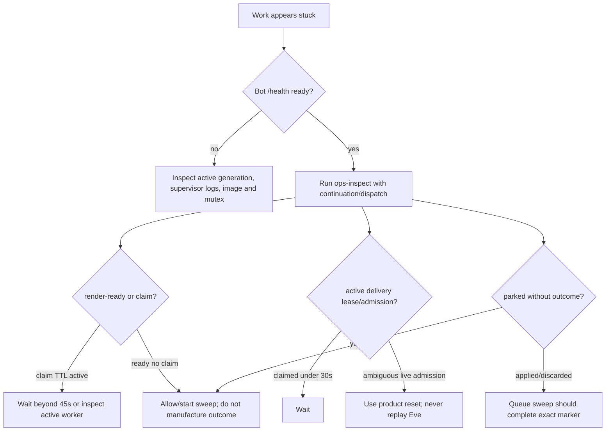

# Execution traces

These are semantic async call stacks from current production code. `⇢` marks a
durable handoff where the original JavaScript stack has ended and another route,
process, or recovery sweep resumes from stored state.

## 1. Bot startup to readiness

```text
container command / local bun run dev
└─ Sentry preload                                      packages/bot/src/instrument.ts
└─ main()                                              packages/bot/src/index.ts
   ├─ installSignalHandlers()                          packages/bot/src/framework/lifecycle.ts
   ├─ createClient()                                   packages/bot/src/framework/gateway.ts
   ├─ buildCommands()                                  packages/bot/src/commands/index.ts
   ├─ getRedis()                                       packages/shared/src/redis/client.ts
   ├─ createConversationStore()                        packages/shared/src/conversations/store.ts
   ├─ createConversationSeam()
   │  ├─ createAgentClient()                           packages/bot/src/agent/client.ts
   │  ├─ createDiscordRest()                           packages/bot/src/agent/render/discord-rest.ts
   │  ├─ createConversationFlow()                      packages/bot/src/utils/conversation/index.ts
   │  └─ createHitlInteractionHandler()                packages/bot/src/agent/hitl/interaction.ts
   ├─ startServer()                                    packages/bot/src/framework/server.ts
   ├─ connect() -> client.login() -> ClientReady       packages/bot/src/framework/gateway.ts
   ├─ flow.start()
   │  └─ sweep: render -> parked -> queue recovery
   ├─ buildEventHandlers() + attachEventRouter()
   ├─ buildSchedules() + startScheduler()
   └─ operationalReady = true
```

The HTTP port binds before login, but `/health` remains 503 until the complete
stack reaches the final latch.

## 2. Addressed Discord message to Eve

```text
Discord gateway MESSAGE_CREATE
└─ attachEventRouter()                                 packages/bot/src/framework/events.ts
   └─ runEventHandlerGroups(mention before message)
      └─ runHandler(agent-chat)
         ├─ dedup.claim(message.id)                    packages/bot/src/framework/dedup.ts
         └─ agentChat.handle()                         packages/bot/src/events/agent-chat.ts
            ├─ stripBotMention()
            ├─ Promise.all(openThread, fetchLeadIn)
            ├─ postPlaceholder(nonce=<source>:0)
            └─ ConversationFlow.submit(payload)        packages/bot/src/utils/conversation/queue.ts
               ├─ store.queue.enqueue(payload)         packages/shared/src/conversations/queue.ts
               │  └─ ENQUEUE_SCRIPT: dedup + FIFO + target + indexes
               └─ kick(continuationKey)
                  ├─ store.queue.claim() -> active lease
                  └─ AgentClient.sendMessage()         packages/bot/src/agent/client.ts
                     └─ POST /discord/message (one attempt)
                        └─ channel route               packages/agents/agent/channels/discord.ts
                           ├─ bearer + decodeDeliveryPayload
                           ├─ admission.start()         packages/shared/src/conversations/admission.ts
                           ├─ Eve send(message, auth, continuationToken, state)
                           ├─ admission.confirm(session.id)
                           └─ strict WireResponse
                  └─ queue.confirm(claimToken, session.id)
```

If another message arrives for the same continuation while active, it ends after
enqueue/claim sees the active record. A later completion `kick()` delivers it.
Different continuation keys run independently.

## 3. Streaming output to Discord

```text
Eve lifecycle event (message.appended/actions.requested/input.requested/...)
└─ Discord channel event handler                      packages/agents/agent/channels/discord.ts
   ├─ mutate plain DiscordChannelState                 packages/agents/agent/lib/discord/state.ts
   └─ publishDesiredRender()
      └─ renderPublisher.publish()                     packages/agents/agent/lib/discord/render-intent.ts
         └─ store.renderPublication.publish()
            └─ PUBLISH_SCRIPT: revision CAS + intent + render-ready
         └─ best-effort POST /internal/agent/render
            ⇢ bot handleRender()                       packages/bot/src/framework/server.ts
               └─ flow.wake({dispatchId})
                  ⇢ sweep/renderDispatches()
                     └─ applyLatest(dispatchId)         packages/bot/src/utils/conversation/render.ts
                        ├─ store.render.claim()         packages/shared/src/conversations/render.ts
                        ├─ loadWork(intent,target,projection)
                        ├─ createRenderer().write()     packages/bot/src/agent/render/renderer.ts
                        │  ├─ renew render lease
                        │  ├─ Discord REST create/edit/delete
                        │  └─ projection checkpoint after each effect
                        └─ store.render.complete()
```

If the callback disappears, `agent:render-ready` is consumed by the next
15-second or startup sweep. The renderer uses stable nonces, content hashes and
checkpoints so another process can converge after an ambiguous Discord response.

## 4. Terminal output and next queued turn

```text
Eve session.waiting/completed/failed
└─ settleAndNotifyParked()                             packages/agents/agent/channels/discord.ts
   └─ renderPublisher.settleAndPark()
      └─ SETTLE_SCRIPT: terminal intent + active parked + marker + ready sets
   └─ best-effort POST /internal/agent/parked
      ⇢ bot handleParked() -> flow.wake(dispatch+continuation)
         ⇢ sweepOnce()
            ├─ renderDispatches()                      terminal paint first
            │  └─ store.render.complete(... terminal) -> outcome=applied
            └─ reconcileParked()
               └─ onParked()
                  ├─ store.render.outcome()
                  ├─ store.queue.complete(parked)      Lua verifies exact outcome
                  └─ kick(continuationKey)             next FIFO item
```

A permanent malformed/unrenderable dispatch may get outcome `discarded`; that is
also a terminal barrier, but telemetry distinguishes it from applied. Missing
outcome leaves the queue parked.

## 5. HITL approval/question response

```text
Discord InteractionCreate
└─ dispatchInteraction()                              packages/bot/src/framework/dispatch.ts
   └─ HITL handler first                              packages/bot/src/agent/hitl/interaction.ts
      ├─ parse opaque component/modal locator
      ├─ load current intent + immutable target + projection
      ├─ verify guild/channel/anchor/dispatch/revision/request/recipient
      ├─ fetch current approver/requester roles when required
      └─ ConversationFlow.answer()
         ├─ store.hitl.claim()                        packages/shared/src/conversations/hitl.ts
         └─ AgentClient.sendInteraction()             retry same interaction ID
            └─ POST /discord/interaction
               └─ conversations.interactions.claim() packages/shared/src/conversations/interaction.ts
                  ├─ bind response/auth digest + ingress atomically
                  └─ Eve send({inputResponses}, current auth)
               └─ interactions.accept(session ack)
         └─ store.hitl.complete()
```

Question inputs can follow this path today. If forwarding exhausts its retries
after the claim, later clicks remain rejected and reset is the practical
recovery. The component identifier chooses a record; it never supplies
authority. Tool approvals are intended to require the
requester for self mode, or a different current approver plus a still-authorized
requester for second-party mode. The current projection requires a policy record
for every tool approval even though only second-party domain approval writes
one, and proxied child requests use a root/child session key mismatch. Those
tool-approval paths fail closed before controls are published; see
[Eve, policy, and integrations](eve-policy-and-integrations.md#known-discord-approval-projection-limitation).

## 6. Private provider authorization

This is the implemented generic Eve event path. Current authored provider
catalogs use application service credentials rather than end-user Connect/OAuth,
so they do not normally trigger it.

```text
Eve authorization.required
└─ Discord channel event handler
   ├─ sanitize HTTPS URL/code/instructions
   ├─ store.authorizations.store(dispatch, authId, challenge, TTL)
   └─ publish public RenderAuthorization (no URL/code)
⇢ bot renderer emits Connect button
⇢ user clicks
└─ HITL handleAuthorization()
   ├─ reload current target/intent/projection
   ├─ require original recipient/current revision/anchor
   ├─ load TTL-bound private challenge
   └─ reply ephemerally with link/code/instructions
```

The public Discord message and persistent render intent never carry the private
challenge URL or code.

## 7. Reset by reaction

```text
Discord MessageReactionAdd(✅)
└─ runHandler(conversation-done)                      packages/bot/src/events/agent-chat.ts
   ├─ turnMessages.get(reaction.message.id)           proves agent reply
   ├─ principalOfReactor()                            current roles
   └─ resetConversationForPrincipal()
      └─ flow.reset()
         ├─ queue.beginReset()                        installs/reuses reset UUID
         └─ AgentClient.sendReset()
            └─ POST /discord/reset
               ├─ waitForResetCutover()               wait ingress drain, max 8s
               └─ Eve reset(continuationToken)
         ├─ queue.commitReset(reset UUID)
         │  └─ purge pre-cutover aggregate + promote reset-pending FIFO
         └─ kick(first post-reset turn)
```

Only the original requester or a current organizer may reset. An ambiguous reset
keeps the barrier; it is retried with the same UUID. Old seen-message and
interaction receipts intentionally remain. A still-indexed old terminal reply
can reset the current session at that same continuation key because the reset
request is not session-ID-fenced; this is current behavior.

## 8. Creating and firing a durable schedule

### Creation

The following is the intended post-approval stack. Normal Discord use currently
cannot project the self-approval control, as described in trace 5.

```text
model -> schedule_task
└─ approveScheduleMutation()                         packages/agents/agent/lib/schedule/owner.ts
   └─ current organizer/write/self policy -> human approval
⇢ tool replay execute()
└─ requireScheduleMutationOwner()                    current role recheck
└─ getScheduleStore().create(owner,input)            packages/agents/agent/lib/schedule/store.ts
   ├─ validate future instant or Croner/IANA recurrence
   └─ INSERT scheduled_tasks RETURNING strict view
```

### Occurrence

```text
Eve minute schedule
└─ dispatchDue()                                     packages/agents/agent/schedules/dispatch.ts
   ├─ scheduleStore.claimDue(limit=25, lease=2m)
   └─ dispatchOne(job)
      ├─ derive stable occurrenceId
      ├─ POST /internal/agent/scheduled
      │  └─ bot flow.admitSchedule()
      │     ├─ scheduledFires.claim()
      │     └─ scheduled adapter admit()
      │        ├─ action=message -> direct Discord nonce; no owner refresh
      │        └─ action=agent
      │           ├─ refresh owner member/roles
      │           └─ placeholder + normal flow.submit()
      │     └─ scheduledFires.complete()
      └─ scheduleStore.complete() or fail()
```

Recurring success advances from the anchored prior occurrence. Failures retry at
1/2/4/8 minutes; the fifth is terminal. A scheduled Eve principal may execute
only tools with effective confirmation `none`.

## 9. Ordinary provider tool without confirmation

```text
model selects tool
└─ inline Eve defineTool executor                    packages/agents/agent/subagents/<domain>/tools/catalog.ts
   └─ guardToolExecution()
      └─ DOMAIN_RUNTIME.executeTool(name,input,ctx)   packages/agents/agent/lib/policy/domain-runtime.ts
         ├─ requirePrincipal(current auth)
         ├─ resolveExecutionAuthority()
         ├─ decideCapability(role/risk/budget/source)
         ├─ provider configuration check
         ├─ DomainToolSpec.input.safeParse()
         ├─ provider SDK/HTTP operation
         ├─ provider-specific output/redaction projection
         ├─ assertToolOutput(plain JSON)
         └─ AuditStore.record(executed/failed)
```

Discovery ran earlier, but execution repeats authority and policy. Provider
configuration is checked here rather than hiding the catalog.

## 10. Second-party destructive provider tool

This is the intended authority/execution stack after approval. Current proxied
Discord child approvals fail at policy-record lookup before the UI stage.

```text
Eve tool approval callback
└─ DOMAIN_RUNTIME.approvalForTool()
   ├─ current requester + policy decision
   ├─ ApprovalPolicyStore.putSecondParty(session,call,binding)
   ├─ audit requested
   └─ return user-approval
⇢ render/input request + separate approver click (trace 5)
⇢ Eve tool executor replay
└─ DOMAIN_RUNTIME.executeTool()
   └─ resolveExecutionAuthority()
      ├─ current approver is distinct and sufficiently privileged
      ├─ read durable session/call/tool/risk/requester binding
      ├─ current requester role from forwarded fresh raw roles
      └─ return requester principal + decidedBy approver
   ├─ repeat capability decision
   ├─ audit approved
   ├─ provider effect
   └─ audit executed/failed as requester, decidedBy approver
```

The approval path and domain `actions.requested` hook are separate audit
producers; confirmation-gated calls can currently produce two Requested rows
with different IDs before later lifecycle states.

## 11. Discord tool

```text
model -> Discord inline tool
└─ shared domain policy (trace 9/10)
└─ registry spec -> tool execute(input)
   └─ subagents/discord/lib/operations/{members,roles-channels,assets,guild,messages}.ts
      ├─ discordRest()                               agent's own REST token, v10
      ├─ fixed-guild/entity preflight
      ├─ Discord Routes.* REST call(s)
      ├─ fail-closed provider guards
      └─ explicit response projection
   └─ DISCORD_RUNTIME.mapFailure -> RateLimited | Transient | UpstreamError
```

There is no cross-process hop: the operation runs in the agent, and a missing
`DISCORD_BOT_TOKEN` is declined by the runtime's `configurationError` rather than
by a transport error. The bot's renderer keeps its own REST client for painting.

Mutations have no idempotency receipt, so a timeout after Discord commits is
ambiguous and is not automatically retried.

## 12. Ordinary community message

```text
Discord MESSAGE_CREATE
└─ attachEventRouter()
   ├─ derived mention handlers first when addressed
   └─ ordinary message handlers concurrently
      ├─ praise
      ├─ auto-thread
      ├─ ship mirror
      ├─ hack-night image upload
      ├─ dashboard mirror
      └─ voice transcription
```

Each sibling first takes its own five-minute Redis claim and then filters. They
are not ordered. For example a noncompliant #ship post may be deleted while the
dashboard mirror concurrently publishes it.

### Bot-local cron occurrence

```text
Croner nominal Indiana instant                           packages/bot/src/framework/schedules.ts
└─ instrument(schedule.<name>)
   ├─ SET bot:schedule:<name>:<IndianaMinute> NX EX 14d
   └─ schedule.run()
      ├─ Friday photography thread                      packages/bot/src/schedules/hack-night-photography-thread.ts
      │  └─ message + pin + thread + role ping + Redis slug mapping
      ├─ Friday Lightning Time countdown                packages/bot/src/schedules/hack-night-countdown.ts
      │  └─ REST latency probes + absolute-time message edits
      └─ Sunday cleanup                                 packages/bot/src/schedules/hack-night-cleanup.ts
         └─ recent thread heuristic + CMS summary + archive/lock
```

A claimed occurrence is not released after failure and there is no catch-up
queue. These are process-local community jobs protected against overlap, not the
Turso-backed user schedule system.

## 13. Supervisor generation rotation

```text
Eve schedule */5                                     agents/agent/schedules/bot-supervisor.ts
└─ reconcileBotSandbox()
   ├─ returns immediately when BOT_SANDBOX_ENABLED=false
   ├─ botSupervisionConfig(env)                      agents/agent/lib/bot/supervisor-config.ts
   └─ supervisor.ensure()                            agents/agent/lib/bot/supervisor.ts
      ├─ acquireLease()                              Lua fence INCR + mutex
      └─ reconcile()
         ├─ read strict active generation
         ├─ inspect SDK object/image/lifetime/health
         ├─ create candidate if not reusable
         ├─ detached bot start -> trace 1 -> strict ready health
         ├─ commitGeneration()                       Redis CAS
         ├─ terminate previous command/Sandbox
         └─ sweep only safe older managed orphans
      └─ releaseLease(exact owner)
```

The new bot may process Discord events before generation commit because bots do
not check the control-plane fence. Application dedup/leases/nonces handle overlap.
Commit precedes cleanup; a cleanup error can make ensure fail after production
already moved to the new active record.

## 14. Production database migration and agent deployment

This is the semantic control path; the database runbook remains the authoritative
operator procedure.

```text
reviewed manual workflow on main                         .github/workflows/database.yml
└─ production environment (reviewer gate only if configured) + concurrency lock
   ├─ enforce quiesced=true, change ticket, names and credentials
   ├─ install checksum-pinned Turso CLI
   ├─ verify provider database URL == approved TURSO_DATABASE_URL
   ├─ create timestamped pre-change PITR clone and verify it exists
   ├─ Drizzle migrate                                  packages/shared/migrations/*.sql
   │  └─ apply whatever the ledger has not recorded
   ├─ verify database                                  packages/shared/scripts/verify-database.ts
   │  └─ quick integrity + ledger/latest hash + required schema subset
   ├─ Vercel pull/link configured agent project
   ├─ production agent deploy
   └─ change summary: bot remains quiesced pending human smoke/re-enable
```

The maintenance checkbox does not fence Eve: its minute dispatcher can still
update due schedule rows while the bot is stopped. The workflow must not run on
that assertion alone; see the current blocker in the database runbook.

Any failure stops later steps. The workflow does not automatically restore the
clone or re-enable ingress; recovery follows the reviewed database runbook. The
clone is the pre-change recovery artifact. Applied migrations are immutable by
policy, not by a complete historical checksum manifest.

## 15. Recovery decision tree



Do not delete a subset of aggregate keys, flush Redis, or write a terminal
outcome by hand. The atomic product reset is the supported cleanup boundary.

## 16. Trace propagation stack

```text
bot traceOperation(event)
└─ activeTraceparent()
   └─ queued DeliveryPayload.traceparent
      └─ AgentClient traceparent header
         └─ Eve traceChannelRequests parents session span
            └─ RenderIntent.traceparent / ScheduledFirePayload.traceparent
               ⇢ bot continueTrace() around recovered request/render
                  └─ operation.completed log + metrics + trace ID
```

Identifiers remain in structured logs rather than metric dimensions. Agent
instrumentation disables prompt/input and output recording; authored logs must
still avoid sensitive content themselves.
