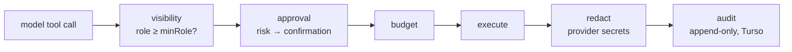

# `@repo/agents`

The reasoning process. An [Eve](https://eve.dev) application that owns sessions, subagents, tools, skills, policy, approvals, and durable scheduling.

It never touches the Discord gateway and never renders the agent's replies — it publishes _desired state_ that `packages/bot` materializes. Its Discord domain tools do call Discord REST directly, but as an ordinary provider integration, on the same policy spine as GitHub or Linear.

## Layout

Eve discovers by filesystem convention, so directory position is semantic:

```
agent/
  agent.ts            root agent: model, instructions, dynamic subagent map
  instructions.md     root system prompt
  env.ts              validated environment
  instrumentation.ts  OpenTelemetry + Sentry wiring
  channels/           discord.ts — the single ingress/egress with the bot
  tools/              root tools: scheduling, audit, docs, web search, organizers
  schedules/          dispatch.ts (durable occurrences), bot-supervisor.ts
  hooks/              cross-cutting session hooks
  subagents/<domain>/ one directory per provider domain
  lib/                everything the above is built from
scripts/              check-capabilities, check-serialization-boundaries, sandbox-admin
```

`lib/` splits by concern: `policy/` (the authorization spine), `core/` (JSON boundary, runtime, redaction), `discord/` (render intents, channel state), `schedule/` (the libSQL store), `code-sandbox/` (the code subagent's harness), `bot/` (Sandbox supervision), `http/`.

## Subagents

Twelve native provider domains plus two auxiliary (`code`, `docs`) — **689 tools across 109 skills**.

| Domain  | Tools | Skills |     | Domain     | Tools | Skills |
| ------- | ----: | -----: | --- | ---------- | ----: | -----: |
| vercel  |   166 |     11 |     | outreach   |    42 |      8 |
| github  |   119 |     16 |     | figma      |    33 |      7 |
| discord |    68 |     14 |     | cloudflare |    29 |      5 |
| sentry  |    68 |     15 |     | notion     |    24 |      4 |
| linear  |    64 |     16 |     | finance    |    16 |      6 |
| cms     |    54 |      6 |     | shopping   |     6 |      1 |

Each domain's own `README.md` carries its skill tree and full tool table,
generated from its registry; `AGENTS.md` beside it holds what the next person
adding a tool there needs to know about the upstream API.

Each domain has the same shape:

```
subagents/<domain>/
  agent.ts              dynamic resolver — returns the subagent, or hides it
  instructions.md       the subagent's system prompt
  lib/registry.ts       every operation and skill, in one registry
  lib/tool_defs/        one file per tool, in skill-named bundles
  lib/skill_defs/       skill prose as markdown, imported as text
  lib/runtime.ts        the domain's policy runtime adapter
  skills/catalog.ts     skills: name, minRole, criteria, tool membership
  tools/catalog.ts      dynamic tool resolution against current auth
```

A tool is declared once, with its access descriptor attached:

```ts
export const create_issue = defineDomainTool({
  description: "Create an issue",
  access: { risk: RiskLevel.Write },
  input: z.strictObject({ repo: z.string(), title: z.string() }),
  execute: async (input, ctx) =>
    guardToolExecution(async () => {
      /* … */
    }),
});
```

Everything else — visibility, approval, budget, audit, redaction — is derived from `access` by the shared runtime. There is no per-domain authorization code.

## The policy spine

`lib/policy/` is the single path from a model tool call to an executed effect:



Decisions are fail-closed: a principal that cannot be resolved gets `public`, and current raw Discord roles override any asserted role tier. Skills are gated `organizer` (92) or `admin` (12); none is `public`.

Discovery filters by role independently of skill loading. Provider configuration is deliberately _not_ a discovery condition — a missing credential is a typed execution-time failure, not a silently hidden capability.

## The JSON boundary

Eve serializes tool results and state across a JSON boundary, so anything that is not plain JSON — a `Date`, `Map`, `Set`, class instance, `Result`, or cycle — corrupts silently. `lib/core/serialization.ts` rejects those at runtime with a `InvariantViolated` naming the exact path and reason.

That only helps if it is actually called, so `lib/core/serialization-boundaries.ts` proves it is, by reading the source: every `defineTool` executor must return through `guardToolExecution`, every `defineState` initializer through `assertStateValue`. Namespace imports of `eve/tools` are refused, because a call behind one would be invisible to a textual analysis. `scripts/check-serialization-boundaries.ts` runs it over `agent/**` in CI.

## Scheduling

Two different things share the name:

- **`schedules/dispatch.ts`** — the durable dispatcher. Scheduled tasks live in Turso; an occurrence becomes a queued turn through the bot's normal flow, with `message` actions posting directly and `agent` actions creating a placeholder-backed turn.
- **`schedules/bot-supervisor.ts`** — infrastructure, not a feature. Holds a Redis fence, starts a digest-pinned bot container, rotates it before Vercel Sandbox's 24-hour cap. Off by default (`BOT_SANDBOX_ENABLED=false`); persistent container hosts do not need it.

## Checks

```bash
bun run check:capabilities     # cross-file invariants over the capability surface
bun run check:serialization    # every Eve boundary is guarded
bun run build                  # eve build (requires Node 24+)
bun run info                   # eve discovery diagnostics
```

`check:capabilities` catches what a code review cannot see, because the defect lives _between_ files and each hunk reads as correct alone:

- a skill referencing a tool the registry does not define
- a registry tool reachable from no skill and not in the base set
- duplicate tool, skill or base names
- a subagent missing `agent.ts` or `instructions.md`
- a subagent with a skill catalog but no tool registry, or the reverse

It deliberately does **not** snapshot the surface. A `minRole` change is one line in a `skills/catalog.ts` and shows up in the diff on its own; pinning a generated copy only adds a second file to update and invites regenerating past the change the pin was meant to surface.

## Conventions

Schemas are canonical zod 4 — top-level string formats, `z.int()`, `z.strictObject()` on every model-facing input, `z.codec()` for genuinely bidirectional conversions, `z.stringFormat()` for named formats so a rejection reports _which_ format failed. The `rayhanadev/*` rules in `.oxlintrc.json` enforce this; a violation is a
lint error, not a review comment.

## Upstream patches

`patches/eve@0.31.3.patch` relaxes one Eve discovery rule so skill prose can
live in `lib/skill_defs/*.md` next to the registry that imports it. Eve
otherwise raises an error-severity diagnostic for any non-module file anywhere
under `lib/`. The patch only silences the diagnostic — markdown is still never
collected as a source — and
[`docs/upstream/eve-lib-markdown.md`](../../docs/upstream/eve-lib-markdown.md)
records the reproduction and the fix to propose upstream.

`nitro.config.ts` is the other half: it teaches rolldown to load `.md` as text,
which Eve exposes no hook for.

Before adding an integration, check `eve registry search <query>` — and read the installed Eve docs at `node_modules/eve/docs/` rather than guessing at the API.
